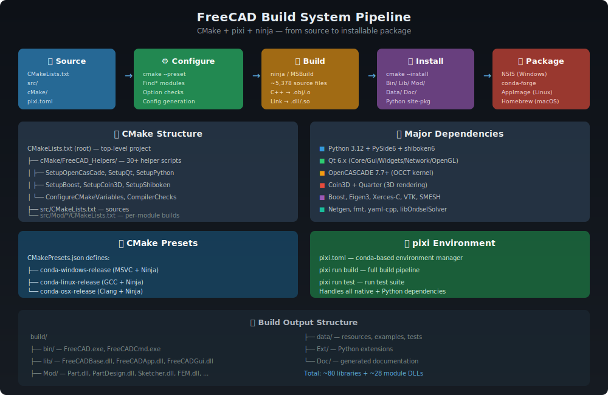

# FreeCAD Build System

> **CMake + pixi + Ninja** — from 5,378 source files to a working CAD application.
> Supports Windows (MSVC), Linux (GCC/Clang), and macOS (Clang) with conda-based dependency management.



---

## 📋 Table of Contents

1. [Overview](#overview)
2. [Build Pipeline](#build-pipeline)
3. [Quick Start](#quick-start)
4. [CMake Structure](#cmake-structure)
5. [CMake Presets](#cmake-presets)
6. [Build Options](#build-options)
7. [Dependencies](#dependencies)
8. [pixi Environment](#pixi-environment)
9. [Module Build System](#module-build-system)
10. [Packaging](#packaging)
11. [Source Files](#source-files)
12. [Further Reading](#further-reading)

---

## Overview

FreeCAD uses a modern CMake-based build system with conda/pixi for dependency management. The build system is designed to be:

- **Cross-platform** — Windows, Linux, macOS from the same source
- **Modular** — each module can be individually enabled/disabled
- **Reproducible** — pixi/conda lock files ensure identical environments
- **Efficient** — Ninja generator, ccache, parallel compile/link pools

### By the Numbers

| Metric | Count |
|--------|-------|
| C++ source files | ~1,884 |
| C++ header files | ~1,863 |
| Python files | ~1,631 |
| Total source files | ~5,378 |
| CMake helper modules | 36 |
| Custom Find modules | 17 |
| Build options | ~50+ |
| Module toggles | ~33 |
| Dependencies | ~70 conda packages |
| Output libraries | ~80 DLLs/SOs |

---

## Build Pipeline

```
Source Code
    │
    ▼
┌─────────────────┐
│  pixi install    │  ← Download all ~70 conda dependencies
│  (conda-forge)   │
└────────┬────────┘
         │
         ▼
┌─────────────────┐
│  cmake --preset  │  ← Configure: Find*, options, compiler checks
│  (CMake 3.22+)   │
└────────┬────────┘
         │
         ▼
┌─────────────────┐
│  cmake --build   │  ← Compile: ~5,378 files → .obj/.o → .dll/.so
│  (Ninja)         │
└────────┬────────┘
         │
         ▼
┌─────────────────┐
│  cmake --install │  ← Install: bin/ lib/ Mod/ data/ Doc/
└────────┬────────┘
         │
         ▼
┌─────────────────┐
│  Package         │  ← NSIS (Win) / AppImage (Linux) / conda
└─────────────────┘
```

---

## Quick Start

### Using pixi (Recommended)

```bash
# Clone
git clone https://github.com/FreeCAD/FreeCAD.git
cd FreeCAD

# Install pixi (if needed)
# See https://prefix.dev/docs/pixi/installation

# Configure + Build + Install (one command)
pixi run build-release

# Or step by step:
pixi run configure-release    # cmake --preset conda-{platform}-release
pixi run build-release        # cmake --build build/release
pixi run install-release      # cmake --install build/release

# Run tests
pixi run test-release

# Launch FreeCAD
pixi run freecad-release
```

### Using build.bat (Windows)

```powershell
.\build.bat build    # Configure + Build
.\build.bat test     # Run tests
```

### Manual CMake

```bash
cmake --preset conda-linux-release
cmake --build build/release --parallel
cmake --install build/release
```

---

## CMake Structure

The build system is organized as a delegation hierarchy:

### Root CMakeLists.txt (157 lines)

The top-level file is remarkably clean — all complexity is delegated to helper macros:

```cmake
cmake_minimum_required(VERSION 3.22.0)
project(FreeCAD)

# 1. Include all helper macros
include(cMake/FreeCAD_Helpers/CompilerChecksAndSetups.cmake)
include(cMake/FreeCAD_Helpers/ConfigureCMakeVariables.cmake)
include(cMake/FreeCAD_Helpers/InitializeFreeCADBuildOptions.cmake)
# ... (30+ includes)

# 2. Execute setup pipeline
CompilerChecksAndSetups()
ConfigureCMakeVariables()
InitializeFreeCADBuildOptions()
CheckInterModuleDependencies()
FreeCADLibpackChecks()
# Setup* macros for each dependency
SetupPython()
SetupQt()
SetupOpenCasCade()
SetupBoost()
SetupCoin3D()
# ... etc

# 3. Add source directories
add_subdirectory(src)

# 4. Packaging
CreatePackagingTargets()
PrintFinalReport()
```

### cMake/FreeCAD_Helpers/ (36 files)

| File | Purpose |
|------|---------|
| `CompilerChecksAndSetups.cmake` | Compiler detection, flags, sanitizers |
| `ConfigureCMakeVariables.cmake` | Install paths, platform settings |
| `InitializeFreeCADBuildOptions.cmake` | All `BUILD_*` and `FREECAD_*` options |
| `CheckInterModuleDependencies.cmake` | Enforce module dependency rules |
| `FreeCADLibpackChecks.cmake` | Windows LibPack detection |
| `SetGlobalCompilerAndLinkerSettings.cmake` | Warning flags, definitions |
| `SetLibraryVersions.cmake` | Library version info |
| `SetupOpenCasCade.cmake` | OpenCASCADE configuration |
| `SetupQt.cmake` | Qt6 detection |
| `SetupPython.cmake` | Python interpreter/libs |
| `SetupBoost.cmake` | Boost libraries |
| `SetupCoin3D.cmake` | Coin3D 3D rendering |
| `SetupShibokenAndPyside.cmake` | PySide6/shiboken6 bindings |
| `SetupEigen.cmake` | Eigen3 linear algebra |
| `SetupSalomeSMESH.cmake` | SMESH meshing library |
| `SetupPybind11.cmake` | pybind11 C++/Python |
| `SetupLibFmt.cmake` | fmt formatting library |
| `SetupLibOndselSolver.cmake` | Assembly solver |
| `SetupDoxygen.cmake` | Documentation generation |
| `SetupPCL.cmake` | Point Cloud Library |
| `SetupLark.cmake` | Lark parser (BIM/IFC) |
| `SetupXercesC.cmake` | Xerces-C XML parser |
| `SetupFreeType.cmake` | FreeType font rendering |
| `SetupOpenGL.cmake` | OpenGL detection |
| `SetupSpaceball.cmake` | 3D mouse support |
| `SetupSwig.cmake` | SWIG bindings (legacy) |
| `SetupLibYaml.cmake` | YAML parser |
| `SetupMatplotlib.cmake` | Matplotlib detection |
| `CreatePackagingTargets.cmake` | CPack packaging |
| `BuildAndInstallDesignerPlugin.cmake` | Qt Designer plugin |
| `CopyLibpackDirectories.cmake` | Windows LibPack copy |
| `PrintFinalReport.cmake` | Build summary |

### Custom Find Modules (17 files)

| Module | Finds |
|--------|-------|
| `FindOCC.cmake` | OpenCASCADE Technology |
| `FindCoin3DDoc.cmake` | Coin3D documentation |
| `FindEigen3.cmake` | Eigen3 linear algebra |
| `FindSMESH.cmake` | Salome SMESH library |
| `FindShiboken6.cmake` | shiboken6 code generator |
| `FindPySide6.cmake` | PySide6 Qt bindings |
| `FindPySide6Tools.cmake` | PySide6 tools (uic, rcc) |
| `FindNETGEN.cmake` | Netgen mesher |
| `FindMEDFile.cmake` | MED file format |
| `FindKDL.cmake` | Orocos KDL kinematics |
| `FindLARK.cmake` | Lark parser |
| `FindMatplotlib.cmake` | Matplotlib |
| `FindOpenCV.cmake` | OpenCV |
| `FindPyCXX.cmake` | PyCXX C++/Python |
| `FindRift.cmake` | Oculus Rift VR |
| `FindSpnav.cmake` | SpaceNavigator |
| `FindPySide2Tools.cmake` | PySide2 (legacy) |

---

## CMake Presets

`CMakePresets.json` defines build configurations:

### Base Presets (Hidden)

| Preset | Settings |
|--------|----------|
| `common` | `CMAKE_EXPORT_COMPILE_COMMANDS=ON`, job pools for compile/link |
| `debug` | `CMAKE_BUILD_TYPE=Debug`, build dir: `build/debug` |
| `release` | `CMAKE_BUILD_TYPE=Release`, build dir: `build/release` |
| `conda` | Ninja, `BUILD_FEM_NETGEN=ON`, `BUILD_WITH_CONDA=ON`, `FREECAD_USE_EXTERNAL_SMESH=ON`, `FREECAD_USE_PCL=ON`, external fmt/pybind11 |

### Platform Presets

| Preset | Compiler | Linker | Notes |
|--------|----------|--------|-------|
| `conda-linux` | Clang/Clang++ | mold | Fast linking |
| `conda-macos` | Clang | default | Ignores Homebrew |
| `conda-windows` | MSVC | default | `FREECAD_LIBPACK_USE=OFF` |

### Composite Presets (User-Facing)

| Preset | Combines |
|--------|----------|
| `conda-linux-debug` | conda + conda-linux + debug |
| `conda-linux-release` | conda + conda-linux + release |
| `conda-macos-debug` | conda + conda-macos + debug |
| `conda-macos-release` | conda + conda-macos + release |
| `conda-windows-debug` | conda + conda-windows + debug |
| `conda-windows-release` | conda + conda-windows + release |

---

## Build Options

### Core Options

| Option | Default | Description |
|--------|---------|-------------|
| `BUILD_GUI` | ON | Build GUI (off = CLI/Python only) |
| `BUILD_WITH_CONDA` | OFF | Conda build mode |
| `FREECAD_USE_CCACHE` | ON | Auto-detect and use ccache |
| `FREECAD_USE_PCH` | ON (MSVC) | Precompiled headers |
| `FREECAD_USE_FREETYPE` | ON | FreeType font support |
| `BUILD_DYNAMIC_LINK_PYTHON` | ON | Link against Python |
| `BUILD_TRACY_FRAME_PROFILER` | OFF | Tracy profiler |
| `ENABLE_DEVELOPER_TESTS` | ON | Build test suite |
| `BUILD_VR` | OFF | Oculus Rift support |

### External Library Options

| Option | Default | Description |
|--------|---------|-------------|
| `FREECAD_USE_EXTERNAL_SMESH` | OFF | System SMESH vs bundled |
| `FREECAD_USE_EXTERNAL_FMT` | ON | System fmt library |
| `FREECAD_USE_EXTERNAL_ZIPIOS` | OFF | System zipios++ |
| `FREECAD_USE_EXTERNAL_KDL` | OFF | System orocos-kdl |
| `FREECAD_USE_EXTERNAL_ONDSELSOLVER` | OFF | System OndselSolver |
| `FREECAD_USE_EXTERNAL_E57FORMAT` | OFF | System libE57Format |
| `FREECAD_USE_EXTERNAL_GTEST` | OFF | System Google Test |
| `FREECAD_USE_PYBIND11` | ON | pybind11 bindings |
| `FREECAD_USE_PCL` | OFF | Point Cloud Library |
| `OCCT_CMAKE_FALLBACK` | OFF | Disable OCCT config |

### Module Toggles (~33)

All default ON unless noted:

```
BUILD_ADDONMGR    BUILD_ASSEMBLY    BUILD_BIM        BUILD_CAM
BUILD_CLOUD       BUILD_DRAFT       BUILD_FEM        BUILD_FLAT_MESH
BUILD_HELP        BUILD_IDF         BUILD_IMPORT     BUILD_INSPECTION
BUILD_MATERIAL    BUILD_MEASURE     BUILD_MESH       BUILD_MESH_PART
BUILD_OPENSCAD    BUILD_PART        BUILD_PART_DESIGN BUILD_PLOT
BUILD_POINTS      BUILD_REVERSEENGINEERING           BUILD_ROBOT
BUILD_SHOW        BUILD_SKETCHER    BUILD_SPREADSHEET BUILD_START
BUILD_SURFACE     BUILD_TECHDRAW    BUILD_TEST       BUILD_TUX
BUILD_WEB
```

### Performance Options

| Option | Default | Description |
|--------|---------|-------------|
| `FREECAD_PARALLEL_COMPILE_JOBS` | auto | Ninja compile job pool |
| `FREECAD_PARALLEL_LINK_JOBS` | auto | Ninja link job pool |

---

## Dependencies

### Major C++ Dependencies

| Library | Version | Purpose |
|---------|---------|---------|
| **OpenCASCADE** | ≥7.7 (7.8+ preferred) | Geometric kernel |
| **Qt 6** | ≥6.5 | UI framework |
| **Python** | ≥3.11 | Scripting engine |
| **PySide6** | matching Qt | Python/Qt bindings |
| **shiboken6** | matching PySide | C++/Python generator |
| **Coin3D** | ≥4.0 | 3D scene graph |
| **Boost** | ≥1.74 | C++ utilities |
| **Eigen3** | ≥3.3 | Linear algebra |
| **Xerces-C** | ≥3.2 | XML parsing |
| **VTK** | ≥9.0 | Visualization (FEM) |
| **SMESH** | custom | Meshing library |
| **Netgen** | ≥6.2 | Tetrahedral meshing |
| **fmt** | ≥9.0 | String formatting |
| **yaml-cpp** | ≥0.7 | YAML parsing |
| **libOndselSolver** | — | Assembly solver |
| **pybind11** | ≥2.11 | C++/Python bindings |
| **FreeType** | ≥2.0 | Font rendering |

### Python Dependencies

| Package | Purpose |
|---------|---------|
| **PySide6** | Qt bindings for Python |
| **pivy** | Coin3D bindings for Python |
| **numpy** | Numerical computing |
| **matplotlib** | Plotting |
| **lark** | Parser for IFC/Step |

---

## pixi Environment

`pixi.toml` defines the complete development environment:

### Tasks

| Task | Command |
|------|---------|
| `configure-debug` | `cmake --preset conda-{platform}-debug` |
| `configure-release` | `cmake --preset conda-{platform}-release` |
| `build-debug` | `cmake --build build/debug` |
| `build-release` | `cmake --build build/release` |
| `install-debug` | `cmake --install build/debug` |
| `install-release` | `cmake --install build/release` |
| `test-debug` | `ctest --test-dir build/debug` |
| `test-release` | `ctest --test-dir build/release` |
| `freecad-debug` | Launch FreeCAD (debug build) |
| `freecad-release` | Launch FreeCAD (release build) |

### Environment

pixi manages **~70 conda-forge packages** including all C++ libraries, Python packages, and build tools. Platform-specific dependencies are handled automatically:

- **Linux**: mesa, X11, wayland, glib
- **Windows**: pthreads-win32
- **macOS**: No extra deps

---

## Module Build System

Each module in `src/Mod/` has its own `CMakeLists.txt`:

```cmake
# Typical module structure:
# src/Mod/Part/CMakeLists.txt

# Guard with build option
if(BUILD_PART)

# C++ App library (core logic)
add_library(Part SHARED ${Part_SRCS})
target_link_libraries(Part FreeCADApp ${OCC_LIBRARIES})

# C++ Gui library (UI)
if(BUILD_GUI)
    add_library(PartGui SHARED ${PartGui_SRCS})
    target_link_libraries(PartGui Part FreeCADGui)
endif()

# Python modules
install(FILES ${Part_Python} DESTINATION Mod/Part)

# Resources
install(DIRECTORY Resources DESTINATION Mod/Part)

endif(BUILD_PART)
```

### Inter-Module Dependencies

`CheckInterModuleDependencies.cmake` enforces rules like:
- PartDesign requires Part and Sketcher
- FEM requires Part and Mesh
- Assembly requires Part
- CAM requires Part

---

## Build Output Structure

```
build/release/
├── bin/
│   ├── FreeCAD.exe          # Main GUI application
│   ├── FreeCADCmd.exe       # Command-line interpreter
│   └── FreeCADLinkView.*    # Optional Link view
├── lib/
│   ├── FreeCADBase.dll      # Base framework
│   ├── FreeCADApp.dll       # Application framework
│   └── FreeCADGui.dll       # GUI framework
├── Mod/
│   ├── Part/
│   │   ├── Part.dll         # Part module
│   │   ├── PartGui.dll      # Part GUI
│   │   └── *.py             # Python modules
│   ├── PartDesign/
│   ├── Sketcher/
│   ├── FEM/
│   └── ... (~28 modules)
├── data/
│   ├── examples/
│   └── tests/
└── Ext/                     # Python extensions
```

---

## Packaging

### Windows (NSIS)

`package/WindowsInstaller/` contains NSIS scripts for creating `.exe` installers.

### Linux (AppImage)

AppImage bundles are created via CI pipelines using conda environments.

### conda-forge

FreeCAD is available via conda-forge:
```bash
conda install -c conda-forge freecad
```

### rattler-build

`package/rattler-build/` contains recipes for building conda packages with rattler-build (faster alternative to conda-build).

---

## Source Files

| Path | Purpose |
|------|---------|
| `CMakeLists.txt` | Root build file (157 lines) |
| `CMakePresets.json` | Build presets (447 lines) |
| `pixi.toml` | Conda environment (197 lines) |
| `cMake/FreeCAD_Helpers/` | 36 helper CMake modules |
| `cMake/Find*.cmake` | 17 custom Find modules |
| `src/CMakeLists.txt` | Source tree entry point |
| `src/Mod/*/CMakeLists.txt` | Per-module build files |
| `package/` | Packaging scripts |

---

## Further Reading

- [FreeCAD README](../../README.md) — Project overview
- [Contributing Guide](../../CONTRIBUTING.md) — Development workflow
- [App Framework](../modules/App.md) — Core application library
- [Gui Framework](../modules/Gui.md) — GUI library

---

*Last updated: 2025 | CMake 3.22+, ~5,378 source files, ~70 dependencies*
