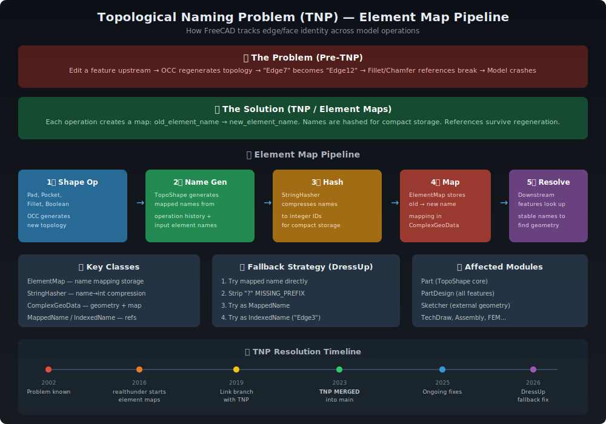

# Element Maps & Topological Naming Problem (TNP)

> **The single most significant architectural challenge in FreeCAD's 22-year history.**
> Solved through a multi-year effort by Zheng Lei (realthunder), merged into mainline in 2023.



---

## 📋 Table of Contents

1. [The Problem](#the-problem)
2. [The Solution](#the-solution)
3. [Architecture Overview](#architecture-overview)
4. [Key Classes](#key-classes)
5. [Element Map Pipeline](#element-map-pipeline)
6. [Name Encoding Scheme](#name-encoding-scheme)
7. [StringHasher Compression](#stringhasher-compression)
8. [Fallback Strategy](#fallback-strategy)
9. [Source Files](#source-files)
10. [Historical Timeline](#historical-timeline)
11. [Further Reading](#further-reading)

---

## The Problem

**The Topological Naming Problem (TNP)** is the fundamental issue that occurs when editing a parametric CAD model:

1. User creates a Box with edges `Edge1` through `Edge12`
2. User applies a **Fillet** to `Edge7`
3. User goes back and **edits the Box** (changes dimensions)
4. OpenCASCADE regenerates the Box topology from scratch
5. What was `Edge7` is now `Edge12` (or gone entirely)
6. **The Fillet reference breaks** → model corruption

This affects **every** downstream reference: Chamfers, Sketcher external geometry, Assembly joints, TechDraw dimensions — any feature that refers to a sub-element by its topological index.

### Why It Happens

OpenCASCADE (OCCT) assigns sub-element indices based on internal creation order. Any change to the shape regeneration sequence can shuffle these indices. OCCT provides no stable identity for sub-elements across regenerations.

---

## The Solution

**Element Maps** provide stable, operation-aware names for every sub-element (vertex, edge, face). Instead of `Edge7`, an element gets a name like:

```
;FUS;:H8c5:7,F;:H8c5:7,F;FUS;:H8c5:6,F;:H8c5:6,F
```

This encoded name embeds:
- **Which operation** created it (FUS = Fuse, CUT = Cut, XTR = Extrude, etc.)
- **Which input elements** contributed to it
- **A unique tag** identifying the owning feature
- **Hash IDs** for compact storage via StringHasher

When the model recomputes, element maps are regenerated. Downstream features look up their references by **mapped name** rather than topological index, surviving the recomputation.

---

## Architecture Overview

```
┌─────────────────────────────────────────────────────────┐
│                    ComplexGeoData                        │
│  ┌──────────────────────────────────────────────────┐  │
│  │              ElementMap                            │  │
│  │  ┌────────────────────┐  ┌─────────────────────┐ │  │
│  │  │  indexedMap         │  │  nameMap             │ │  │
│  │  │  Edge1 → MappedName│  │  MappedName → Edge1  │ │  │
│  │  │  Edge2 → MappedName│  │  MappedName → Edge2  │ │  │
│  │  │  Face1 → MappedName│  │  MappedName → Face1  │ │  │
│  │  └────────────────────┘  └─────────────────────┘ │  │
│  │               ↓                                    │  │
│  │        StringHasher                                │  │
│  │  ┌──────────────────────────────────────────────┐ │  │
│  │  │  ID 1 → "FUS"         (operation code)       │ │  │
│  │  │  ID 2 → ":H8c5:7,F"  (element reference)    │ │  │
│  │  │  ID 3 → "#1#2"        (compressed: ID1+ID2)  │ │  │
│  │  └──────────────────────────────────────────────┘ │  │
│  └──────────────────────────────────────────────────┘  │
│                                                         │
│                  TopoShape (OCCT wrapper)               │
│  ┌──────────────────────────────────────────────────┐  │
│  │  makeElementFuse()   → builds element map         │  │
│  │  makeElementCut()    → builds element map         │  │
│  │  makeElementFillet() → builds element map         │  │
│  │  ...40+ operations                                │  │
│  └──────────────────────────────────────────────────┘  │
└─────────────────────────────────────────────────────────┘
```

---

## Key Classes

### IndexedName

**File:** `src/App/IndexedName.h` (~425 lines)

Memory-efficient representation of traditional names like `Edge1`, `Face345`. Separates the type string (`Edge`, `Face`, `Vertex`) from the integer index. Reuses character storage across instances with the same type via an internal static table.

```cpp
// Internal structure:
// - const char* Type  → "Edge" (shared pointer)
// - int Index         → 7
// Produces: "Edge7"
```

### MappedName

**File:** `src/App/MappedName.h` (~1,136 lines)

Two-part name consisting of immutable **data** (QByteArray) + mutable **postfix** (QByteArray). Can be constructed from StringID, raw strings, or other MappedNames. Supports shared data via `setRawData()` for zero-copy when possible.

```cpp
// A MappedName might look like:
// data:    ";FUS;:H8c5:7,F"
// postfix: ";:H8c5:6,F"
// Full:    ";FUS;:H8c5:7,F;:H8c5:6,F"
```

### MappedElement

**File:** `src/App/MappedElement.h` (~129 lines)

Simple struct pairing an `IndexedName` and a `MappedName` together. The bridge between old-style names and TNP-aware names.

### ElementMap

**File:** `src/App/ElementMap.h` (~370 lines) + `src/App/ElementMap.cpp` (~1,360 lines)

The core mapping engine. Maintains bidirectional maps:

| Field | Type | Purpose |
|-------|------|---------|
| `indexedMap` | `map<type, deque<MappedElement>>` | IndexedName → MappedName |
| `nameMap` | `map<MappedName, IndexedName>` | MappedName → IndexedName (reverse) |
| `hasher` | `StringHasherRef` | String compression |
| `childElements` | `map<...>` | Sub-shape hierarchical maps |

**Key Methods:**
- `setElementName()` — Map an IndexedName ↔ MappedName
- `encodeElementName()` — Generate encoded names with tags
- `find()` — Look up IndexedName by mapped name
- `findAll()` — Look up MappedName by indexed name
- `addChildElements()` — Add hierarchical sub-shape mappings
- `hashChildMaps()` — Compress child names via hashing
- `save()` / `restore()` — Serialization

### StringHasher

**File:** `src/App/StringHasher.h` (~726 lines) + `src/App/StringHasher.cpp` (~766 lines)

String table that assigns integer IDs to strings. Deduplicates and compresses by encoding prefix/postfix as references to other StringIDs.

```
String: ";FUS;:H8c5:7,F;:H8c5:6,F"
→ StringID #3 = "#1#2"        (prefix=ID1, postfix=ID2)
→ StringID #1 = ";FUS"        (operation code)
→ StringID #2 = ";:H8c5:7,F"  (element reference)
```

**StringID Flags:** `Hashed`, `Postfixed`, `Indexed`, `Persistent`, `Binary`, `Marked`, `PrefixID`, `PostfixID`, `MappedName`

### ComplexGeoData

**File:** `src/App/ComplexGeoData.h` (~651 lines)

Abstract base class (inherits `Base::Persistence`, `Base::Handled`). Owns an `ElementMap` and a `Tag` (long). Provides the public element-mapping API.

**Public API:**
- `setElementName()` / `getElementName()` — Access element maps
- `resetElementMap()` — Clear and rebuild
- `getElementMappedNames()` — Get all mapped names for an index
- `traceElement()` — Trace name through shape history
- `getElementHistory()` — Iterate history with callback

### TopoShape

**File:** `src/Mod/Part/App/TopoShape.h` (~2,871 lines) + `src/Mod/Part/App/TopoShape.cpp` (~4,113 lines)

Inherits `ComplexGeoData`. Wraps `TopoDS_Shape` (OCCT). All shape operations generate element maps via `makeElement*()` methods:

| Method | OpCode | Description |
|--------|--------|-------------|
| `makeElementFuse()` | FUS | Boolean union |
| `makeElementCut()` | CUT | Boolean subtraction |
| `makeElementFillet()` | FLT | Edge rounding |
| `makeElementChamfer()` | CHF | Edge chamfering |
| `makeElementExtrude()` | XTR | Linear extrusion |
| `makeElementRevolve()` | RVL | Revolution |
| `makeElementLoft()` | LFT | Loft through sections |
| `makeElementPipe()` | SWP | Sweep along path |
| `makeElementBoolean()` | — | Generic boolean |
| `makeElementMirror()` | MIR | Mirror operation |
| `makeElementOffset()` | OFS | Offset shape |
| `makeElementThickSolid()` | THK | Shell thickening |
| ~30 more... | | |

---

## Element Map Pipeline

### Step 1: Shape Operation

A feature (e.g., Pad) calls `TopoShape::makeElementExtrude()`. Internally, this calls OCCT's `BRepPrimAPI_MakePrism` to create the new shape.

### Step 2: Name Generation

The operation traces OCCT's shape history (`BRepBuilderAPI_MakeShape::Generated()` / `Modified()` / `IsDeleted()`) to determine which old sub-elements map to which new ones.

### Step 3: Name Encoding

`ElementMap::encodeElementName()` builds a `MappedName` that embeds:
- The **Tag** (owner object's unique ID)
- The **OpCode** (3-letter operation identifier)
- The **parent element references** (input names that produced this output)

### Step 4: String Compression

`StringHasher` assigns integer IDs to name fragments. Recursive encoding — a prefix/postfix can reference other StringIDs via `#<hex>` notation — achieves extreme compression for deep operation histories.

### Step 5: Map Storage

The `ElementMap` stores the bidirectional mapping in the shape's `ComplexGeoData`. This is persisted with the document.

### Step 6: Reference Resolution

When a downstream feature (e.g., Fillet) needs to find its referenced element, it looks up the **MappedName** in the upstream shape's ElementMap. Even if indices have shuffled, the mapped name resolves to the correct geometry.

---

## Name Encoding Scheme

Element names follow a structured encoding (version 15 as of current code):

```
;OpCode;:Htag:index,Type[;...]
```

Where:
- `;` — separator
- `OpCode` — 3-letter operation identifier (see OpCodes table)
- `:H` — tag prefix (hexadecimal)
- `tag` — the feature's unique Tag value
- `index` — sub-element index within the operation
- `Type` — element type character: `V` (vertex), `E` (edge), `F` (face)

### Operation Codes (OpCodes)

| Code | Operation | Code | Operation |
|------|-----------|------|-----------|
| FUS | Fuse | CUT | Cut |
| XTR | Extrude | RVL | Revolve |
| FLT | Fillet | CHF | Chamfer |
| SKT | Sketch | LFT | Loft |
| SWP | Sweep/Pipe | MIR | Mirror |
| OFS | Offset | THK | ThickSolid |
| SEC | Section | SLC | Slice |
| BOP | BooleanOp | TRF | Transform |
| DRF | Draft | SEW | Sew |
| ~40 total | | | |

---

## StringHasher Compression

StringHasher provides memory-efficient storage for the potentially enormous element name strings:

```
Without compression:
  ";FUS;:H8c5:7,F;:H8c5:6,F;CUT;:Ha3e:12,F;:Ha3e:11,F"
  = 52 bytes per element × thousands of elements = MB of names

With compression:
  StringID #1 = ";FUS"
  StringID #2 = ";:H8c5:7,F"
  StringID #3 = ";:H8c5:6,F"
  StringID #4 = ";CUT"
  StringID #5 = ";:Ha3e:12,F"
  StringID #6 = ";:Ha3e:11,F"
  MappedName = "#1#2#3#4#5#6"   (24 bytes, shared IDs)
```

Shared StringIDs across all elements in a shape means common operation codes and tag references are stored only once.

---

## Fallback Strategy

When TNP lookup fails (element map missing or corrupted), a multi-level fallback strategy is employed:

### Standard Fallback (PropertyLinkSub)

1. Try the mapped name directly via `getElementName()`
2. Check for shadow sub-element names (TNP names stored alongside old names)
3. Fall back to indexed name (`Edge3`) as last resort

### DressUp Fallback (Fillet/Chamfer)

The `FeatureDressUp::getContiguousEdges()` method implements a 4-step fallback:

1. **Direct lookup** — try the sub-element name as-is
2. **Strip MISSING_PREFIX** — remove leading `?` from TNP-prefixed names
3. **Try as MappedName** — look up the stripped name in the element map
4. **Try as IndexedName** — fall back to traditional `Edge3` resolution

This fallback was added to fix Fillet/Chamfer failures when element maps became inconsistent during complex model edits.

---

## Source Files

### Core TNP Infrastructure (~11,427 lines)

| File | Lines | Purpose |
|------|-------|---------|
| `src/App/ElementMap.h` | 370 | ElementMap class definition |
| `src/App/ElementMap.cpp` | 1,360 | ElementMap implementation |
| `src/App/StringHasher.h` | 726 | StringHasher + StringID classes |
| `src/App/StringHasher.cpp` | 766 | StringHasher implementation |
| `src/App/MappedName.h` | 1,136 | MappedName two-part name |
| `src/App/MappedName.cpp` | 227 | MappedName implementation |
| `src/App/IndexedName.h` | 425 | IndexedName (Edge1, Face2) |
| `src/App/IndexedName.cpp` | 105 | IndexedName implementation |
| `src/App/MappedElement.h` | 129 | IndexedName + MappedName pair |
| `src/App/ComplexGeoData.h` | 651 | Abstract geometry base |
| `src/App/ComplexGeoData.cpp` | 653 | ComplexGeoData implementation |

### TopoShape Integration (~6,984 lines)

| File | Lines | Purpose |
|------|-------|---------|
| `src/Mod/Part/App/TopoShape.h` | 2,871 | TopoShape with element maps |
| `src/Mod/Part/App/TopoShape.cpp` | 4,113 | makeElement*() operations |

---

## Historical Timeline

| Year | Milestone |
|------|-----------|
| **2002** | TNP identified as fundamental problem in OCC-based parametric CAD |
| **2016** | Zheng Lei (realthunder) begins developing element maps in his Link branch |
| **2019** | realthunder's Link3 branch demonstrates complete TNP solution |
| **2020-2022** | Community testing, refinement, and porting efforts |
| **2023** | **TNP merged into mainline FreeCAD** — largest single integration in project history |
| **2024-2025** | Ongoing bug fixes, performance optimization, DressUp fallback improvements |

---

## Further Reading

- [Part Module](../modules/Part.md) — TopoShape is Part's core class
- [PartDesign Module](../modules/PartDesign.md) — Most complex TNP consumer
- [Property System](PropertySystem.md) — PropertyLinkSub stores TNP shadow names
- [App Framework](../modules/App.md) — ComplexGeoData lives in App
- [realthunder's TNP Wiki](https://github.com/realthunder/FreeCAD/wiki/Topological-Naming) — Original design documentation

---

*Last updated: 2025 | ~18,411 lines of TNP-related code*
