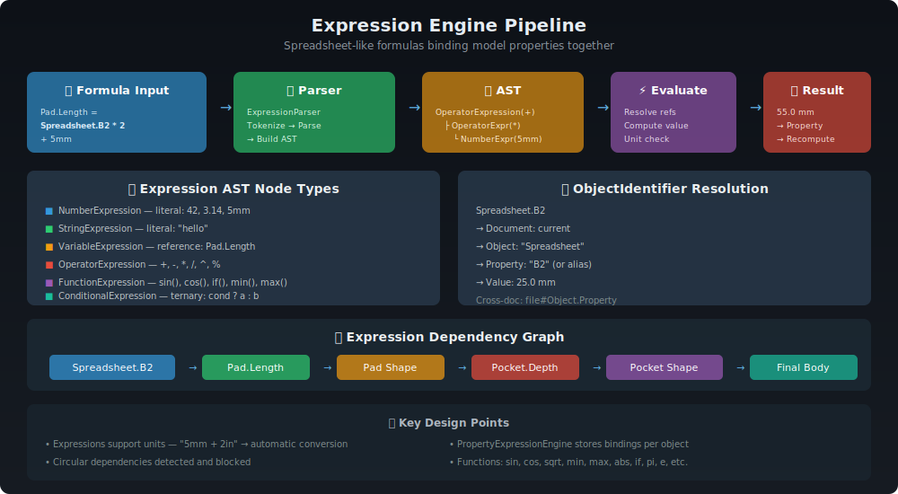

# FreeCAD Expression Engine

> **Spreadsheet-like formulas that bind model properties together.** Write `Pad.Length = Spreadsheet.B2 * 2 + 5mm`
> and the model updates automatically when the spreadsheet cell changes.



---

## 📋 Table of Contents

1. [Overview](#overview)
2. [Architecture](#architecture)
3. [Expression AST](#expression-ast)
4. [Parser & Lexer](#parser--lexer)
5. [ObjectIdentifier](#objectidentifier)
6. [Functions & Operators](#functions--operators)
7. [Unit System Integration](#unit-system-integration)
8. [Dependency Tracking](#dependency-tracking)
9. [Spreadsheet Integration](#spreadsheet-integration)
10. [Source Files](#source-files)
11. [Further Reading](#further-reading)

---

## Overview

The Expression Engine allows **any** property in FreeCAD to be driven by a mathematical formula. Expressions can reference other properties, perform arithmetic with unit awareness, call mathematical functions, and create parametric relationships across the entire model.

### Key Capabilities

| Feature | Example |
|---------|---------|
| Arithmetic | `Length * 2 + 5mm` |
| Unit conversion | `5mm + 2in` → automatic |
| Property references | `Spreadsheet.B2` |
| Cross-object refs | `Pad.Length / 2` |
| Functions | `sin(45deg)`, `sqrt(x^2 + y^2)` |
| Conditionals | `Length > 10mm ? 5mm : 2mm` |
| Cell ranges | `sum(Spreadsheet.A1:A10)` |
| Constants | `pi`, `e` |

### By the Numbers

| Metric | Count |
|--------|-------|
| Source files | 14+ |
| Total lines of code | ~20,830 |
| Built-in functions | ~80 |
| Operator types | 16 |
| AST node types | 9 |

---

## Architecture

```
┌─────────────────────────────────────────────────────────┐
│                    Expression Engine                      │
│                                                           │
│  ┌─────────┐    ┌──────────┐    ┌──────────┐    ┌─────┐│
│  │ Formula  │ →  │  Lexer   │ →  │  Parser  │ →  │ AST ││
│  │ String   │    │  (Flex)  │    │ (Bison)  │    │     ││
│  └─────────┘    └──────────┘    └──────────┘    └──┬──┘│
│                                                     │    │
│  ┌──────────────────────────────────────────────────┘    │
│  │                                                        │
│  ▼                                                        │
│  ┌──────────────────────┐    ┌─────────────────────────┐ │
│  │  ObjectIdentifier    │    │  PropertyExpression-     │ │
│  │  Resolution          │    │  Engine                  │ │
│  │                      │    │                          │ │
│  │  Document → Object   │    │  Property → Expression   │ │
│  │  → Property → Value  │    │  bindings for each       │ │
│  └──────────────────────┘    │  DocumentObject          │ │
│                              └─────────────────────────┘ │
│                                                           │
│  ┌────────────────────────────────────────────────────┐  │
│  │              Dependency Graph                       │  │
│  │  Spreadsheet.B2 → Pad.Length → Pocket.Depth → ...  │  │
│  │  Circular dependency detection & blocking           │  │
│  └────────────────────────────────────────────────────┘  │
└─────────────────────────────────────────────────────────┘
```

---

## Expression AST

The parser builds an **Abstract Syntax Tree** (AST) from the expression string. All nodes inherit from `Expression`:

### Node Hierarchy

```
Expression (abstract base)
├── UnitExpression         — Quantity with unit (e.g., "5 mm")
│   ├── NumberExpression   — Numeric literal with optional unit
│   │   └── ConstantExpression — Named constant (pi, e)
│   ├── OperatorExpression — Binary/unary operators (+, -, *, /, ^)
│   ├── FunctionExpression — Function calls (sin, cos, sqrt, etc.)
│   └── VariableExpression — Property reference via ObjectIdentifier
├── ConditionalExpression  — Ternary: condition ? trueExpr : falseExpr
├── StringExpression       — String literal
├── PyObjectExpression     — Python object wrapper
└── RangeExpression        — Cell range (A1:B5)
```

### Expression Base Class

Every AST node provides:

| Method | Purpose |
|--------|---------|
| `eval()` | Evaluate to a value (returns new Expression) |
| `simplify()` | Constant folding / simplification |
| `toString()` | Serialize back to string |
| `copy()` | Deep clone the expression tree |
| `getIdentifiers()` | Extract all ObjectIdentifier references |
| `getDeps()` | Get dependency set for dependency graph |
| `visit()` | Accept a visitor for tree traversal |
| `isTouched()` | Check if referenced values have changed |

### Example AST

For the expression `Spreadsheet.B2 * 2 + 5mm`:

```
OperatorExpression (+)
├── OperatorExpression (*)
│   ├── VariableExpression("Spreadsheet.B2")
│   └── NumberExpression(2)
└── NumberExpression(5, mm)
```

---

## Parser & Lexer

The expression parser is built using **Bison** (parser generator) and **Flex** (lexer generator):

### Lexer (ExpressionParser.l — 328 lines)

Tokenizes the expression string into:
- Numbers: `42`, `3.14`, `1.5e-3`
- Units: `mm`, `in`, `deg`, `rad`, `kg`, `s`
- Identifiers: `Length`, `Spreadsheet`, `B2`
- Operators: `+`, `-`, `*`, `/`, `^`, `%`, `==`, `!=`, `<`, `>`, `<=`, `>=`
- Special: `?`, `:`, `(`, `)`, `,`, `<<`, `>>`

### Grammar (ExpressionParser.y — 228 lines)

Bison grammar with operator precedence:

```
expression:
    | expression '+' expression    → OperatorExpression(ADD)
    | expression '*' expression    → OperatorExpression(MUL)
    | IDENTIFIER                   → VariableExpression
    | NUMBER                       → NumberExpression
    | FUNC '(' args ')'            → FunctionExpression
    | expression '?' expression ':' expression → ConditionalExpression
    | STRING                       → StringExpression
    | CELLADDR ':' CELLADDR        → RangeExpression
    ;
```

### String Quoting

Expression strings use `<<` `>>` for string quoting (since `"` denotes inches and `'` denotes feet in CAD context):

```
<<Hello World>>    → StringExpression("Hello World")
```

---

## ObjectIdentifier

`ObjectIdentifier` is the path system that resolves property references in expressions.

### Path Syntax

```
[Document#]Object.Property[.SubProperty]
```

Examples:
- `Length` — current object's Length property
- `Pad.Length` — Pad object's Length property
- `Spreadsheet.B2` — Spreadsheet cell B2
- `<<My Box>>.Width` — label-based reference
- `file.FCStd#Box.Length` — cross-document reference

### Component Types

An ObjectIdentifier is a sequence of **Components**:

| Type | Syntax | Description |
|------|--------|-------------|
| Simple | `Name` | Property or object name |
| Index | `[3]` | Array element access |
| Key | `["key"]` | Map key access |
| Range | `[1:5]` | Slice notation |

### Resolution Pipeline

1. **Parse** — Grammar rules in `ExpressionParser.y` construct ObjectIdentifier
2. **Resolve** — `resolve()` disambiguates Document/Object/Property patterns
3. **Lookup** — `getDocumentObject()` / `getProperty()` walk the document tree
4. **Canonicalize** — `canonicalPath()` normalizes for comparison
5. **Label support** — References using `<<Label>>` auto-update when labels change via `renameObjectIdentifiers()`

### Key Classes

| Class | Role |
|-------|------|
| `ObjectIdentifier` | The path itself — owns components |
| `String` | Path component — identifier or quoted string |
| `Component` | Name + optional index/key/range |
| `DocumentMapper` | RAII scope for document name remapping during import |

### Key Fields

| Field | Type | Purpose |
|-------|------|---------|
| `owner` | `DocumentObject*` | Local resolution context |
| `documentName` | `String` | Target document |
| `documentObjectName` | `String` | Target object |
| `subObjectName` | `String` | Sub-object path |
| `shadowSub` | `String` | TNP shadow name |
| `components` | `vector<Component>` | Property path components |
| `_cache` | `string` | Cached string representation |

---

## Functions & Operators

### Operators (16 types)

| Operator | Symbol | Operator | Symbol |
|----------|--------|----------|--------|
| Addition | `+` | Subtraction | `-` |
| Multiplication | `*` | Division | `/` |
| Exponent | `^` | Modulo | `%` |
| Equal | `==` | Not Equal | `!=` |
| Less Than | `<` | Greater Than | `>` |
| Less/Equal | `<=` | Greater/Equal | `>=` |
| Negate | `-` (unary) | Positive | `+` (unary) |
| Unit multiply | implicit | Unit division | implicit |

### Mathematical Functions (~80 total)

| Category | Functions |
|----------|-----------|
| **Trigonometric** | `sin`, `cos`, `tan`, `asin`, `acos`, `atan`, `atan2`, `sinh`, `cosh`, `tanh` |
| **Power/Root** | `sqrt`, `cbrt`, `pow`, `exp`, `log`, `log2`, `log10`, `hypot` |
| **Rounding** | `abs`, `ceil`, `floor`, `round`, `trunc`, `sign` |
| **Extremes** | `min`, `max`, `clamp` |
| **Aggregate** | `sum`, `count`, `average`, `stddev`, `min`, `max`, `median` |
| **Vector** | `vangle`, `vcross`, `vdot`, `vlength`, `vnormalize`, `vscale`, `vlinedist`, `vlineproj`, `vplanedist`, `vplaneproj` |
| **Matrix** | `minvert`, `mrotate`, `mrotatex`, `mrotatey`, `mrotatez`, `mscale`, `mtranslate` |
| **Object Creation** | `vector`, `matrix`, `placement`, `rotation`, `create` |
| **Special** | `hiddenref`, `dbind`, `str`, `parsequant`, `translationunit` |
| **Constants** | `pi`, `e` |

---

## Unit System Integration

Expressions natively support **unit arithmetic**:

```
5mm + 2in                    → 55.8mm (automatic conversion)
10kg * 9.81m/s^2             → 98.1N (derived unit)
sin(45deg)                   → 0.707... (dimensionless)
Pad.Length / 2               → preserves mm unit
sqrt(Area)                   → length unit
```

### How It Works

1. `NumberExpression` stores a `Base::Quantity` (value + `Base::Unit`)
2. `OperatorExpression` performs unit arithmetic (multiply/divide combine units)
3. Unit compatibility is checked during evaluation — `5mm + 2kg` raises an error
4. `PropertyQuantity` subclasses (PropertyLength, etc.) enforce expected units

---

## Dependency Tracking

Expressions create a **directed acyclic graph** (DAG) of dependencies:

```
Spreadsheet.B2
    ↓
Pad.Length = Spreadsheet.B2 * 2
    ↓
Pocket.Depth = Pad.Length / 3
    ↓
Final shape recompute
```

### How Dependencies Are Tracked

1. `Expression::getIdentifiers()` extracts all `ObjectIdentifier` references from an expression tree
2. `PropertyExpressionEngine` registers these as dependencies with the `Document` dependency graph
3. On recompute, `Document` processes objects in topological sort order
4. **Circular dependencies** are detected and blocked — setting a circular expression raises an error

### hiddenref() Function

The `hiddenref()` function creates a reference that does **not** contribute to the dependency graph:

```
Pad.Length = hiddenref(Spreadsheet.B2) * 2
```

This is useful for breaking circular dependency chains or creating informational references that shouldn't trigger recomputation.

---

## Spreadsheet Integration

The Spreadsheet module is the primary consumer of expressions:

```
Cell A1: = 25.0
Cell A2: = A1 * 2         → 50.0
Cell A3: = sin(A1 * pi/180) → 0.4226...
Cell B1: = Pad.Length      → reads from model
```

### Cell Aliases

Spreadsheet cells can have aliases for readability:

```
Cell B2 alias "Width" → Pad.Length = Spreadsheet.Width
```

### RangeExpression

Aggregate functions use `RangeExpression` for cell ranges:

```
= sum(A1:A10)
= average(B1:B5)
= count(C1:C100)
```

---

## Source Files

### Core Expression Engine

| File | Lines | Purpose |
|------|-------|---------|
| `src/App/Expression.h` | 501 | Base Expression class |
| `src/App/Expression.cpp` | 3,331 | Expression evaluation |
| `src/App/ExpressionNode.h` | 563 | Concrete AST node types |
| `src/App/ExpressionParser.y` | 228 | Bison grammar |
| `src/App/ExpressionParser.l` | 328 | Flex lexer |
| `src/App/ExpressionParser.tab.c` | 1,518 | Generated parser |
| `src/App/lex.ExpressionParser.c` | 9,451 | Generated lexer |
| `src/App/ExpressionTokenizer.h` | 45 | Autocomplete tokenizer |
| `src/App/ExpressionTokenizer.cpp` | 132 | Tokenizer implementation |
| `src/App/ExpressionVisitors.h` | 125 | Visitor pattern utilities |

### ObjectIdentifier

| File | Lines | Purpose |
|------|-------|---------|
| `src/App/ObjectIdentifier.h` | 1,481 | Path resolution system |
| `src/App/ObjectIdentifier.cpp` | 1,754 | ObjectIdentifier implementation |

### Expression Binding

| File | Lines | Purpose |
|------|-------|---------|
| `src/App/PropertyExpressionEngine.h` | 315 | Binding expressions to properties |
| `src/App/PropertyExpressionEngine.cpp` | 1,058 | Expression engine implementation |

**Total: ~20,830 lines**

---

## Design Patterns

### Visitor Pattern

Expression trees support visitor-based traversal:

```cpp
class ExpressionVisitor {
    virtual void visit(Expression &e) = 0;
};

// Usage: collect all variable references
struct DepCollector : ExpressionVisitor {
    void visit(Expression &e) override {
        if (auto *var = dynamic_cast<VariableExpression*>(&e))
            deps.insert(var->getPath());
    }
};
```

### Bison/Flex Integration

The grammar produces AST nodes directly in semantic actions:

```yacc
expression '+' expression {
    $$ = new OperatorExpression(owner, $1, OP_ADD, $3);
}
```

### Lazy Evaluation

`eval()` returns a **new** Expression (typically NumberExpression) representing the computed value. `simplify()` performs constant folding — replacing sub-trees with no variable references by their evaluated values.

### Python Integration

Expressions can evaluate to Python objects via `PyObjectExpression`. The `create()` function and other special functions bridge between the expression system and Python:

```
create(<<vector>>; 1; 2; 3)  → Python Vector(1, 2, 3)
```

---

## Further Reading

- [Property System](PropertySystem.md) — Expressions bind to properties
- [Spreadsheet Module](../modules/Spreadsheet.md) — Primary expression consumer
- [App Framework](../modules/App.md) — Expression engine lives in App
- [Element Maps & TNP](ElementMaps_TNP.md) — ObjectIdentifier supports shadow sub-names

---

*Last updated: 2025 | ~80 functions, 16 operators, ~20,830 lines of code*
