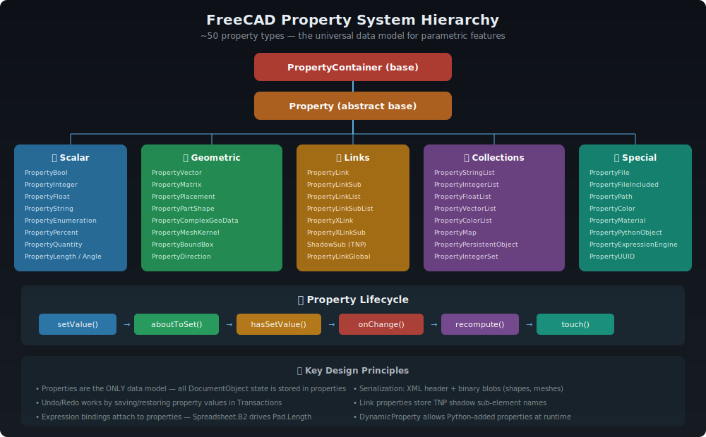

# FreeCAD Property System

> **The universal data model for all parametric features.** Every piece of state in a FreeCAD document
> is stored as a Property — from simple booleans to complex 3D shapes.



---

## 📋 Table of Contents

1. [Overview](#overview)
2. [Architecture](#architecture)
3. [Property Hierarchy](#property-hierarchy)
4. [Property Lifecycle](#property-lifecycle)
5. [Link Properties](#link-properties)
6. [Dynamic Properties](#dynamic-properties)
7. [Expression Binding](#expression-binding)
8. [Serialization](#serialization)
9. [Source Files](#source-files)
10. [Design Patterns](#design-patterns)
11. [Further Reading](#further-reading)

---

## Overview

The Property System is FreeCAD's **core data model**. Every `DocumentObject` stores its entire state as a collection of typed properties. This design enables:

- **Undo/Redo** — property values are saved/restored in transactions
- **Serialization** — documents are saved by iterating all properties
- **Expression binding** — spreadsheet formulas drive property values
- **Change notification** — UI updates when properties change
- **Python access** — all properties are exposed to Python
- **Parametric recomputation** — property changes trigger feature recalculation

### By the Numbers

| Metric | Count |
|--------|-------|
| Concrete property types | ~125+ |
| Core source files | 18+ |
| Total lines of code | ~18,500 |
| Property status flags | 32 bits |
| PropertyType flag bits | 16+ |

---

## Architecture

```
┌──────────────────────────────────────────────────────┐
│                   PropertyContainer                   │
│  ┌────────────────────────────────────────────────┐  │
│  │  PropertyData (static)                          │  │
│  │  ┌──────────────────────────────────────────┐  │  │
│  │  │  Name → Offset → Type → Group → Doc      │  │  │
│  │  │  "Length" → 48 → Float → "Base" → "..."   │  │  │
│  │  │  "Shape" → 128 → PartShape → "..." → "." │  │  │
│  │  └──────────────────────────────────────────┘  │  │
│  └────────────────────────────────────────────────┘  │
│                        │                              │
│                        ▼                              │
│  ┌────────────────────────────────────────────────┐  │
│  │  DynamicProperty (runtime)                      │  │
│  │  ┌──────────────────────────────────────────┐  │  │
│  │  │  Python-added properties                  │  │  │
│  │  │  FeaturePython custom attributes          │  │  │
│  │  └──────────────────────────────────────────┘  │  │
│  └────────────────────────────────────────────────┘  │
│                                                       │
│  DocumentObject inherits PropertyContainer            │
│  ViewObject inherits PropertyContainer                │
└──────────────────────────────────────────────────────┘
```

### Core Components

| Class | Role |
|-------|------|
| `Property` | Abstract base — ~32 status bits, change notification, serialization |
| `PropertyContainer` | Owns properties, provides iteration and lookup |
| `PropertyData` | Static metadata (name, group, doc, offset, type flags) |
| `DynamicProperty` | Runtime property addition for Python objects |
| `AtomicPropertyChangeInterface` | CRTP template for transactional changes |
| `PropertyListsBase` | Base for list-valued properties |

---

## Property Hierarchy

### Scalar Properties

| Class | Type | Description |
|-------|------|-------------|
| `PropertyBool` | bool | Boolean on/off |
| `PropertyInteger` | long | Integer value |
| `PropertyIntegerConstraint` | long | Integer with min/max |
| `PropertyPercent` | long | 0-100 range |
| `PropertyFloat` | double | Floating-point value |
| `PropertyFloatConstraint` | double | Float with min/max/step |
| `PropertyPrecision` | double | Positive-only float |
| `PropertyString` | string | Text value |
| `PropertyFont` | string | Font name |
| `PropertyEnumeration` | int | Enum from string list |
| `PropertyUUID` | UUID | Universally unique ID |

### Quantity Properties (~61 types)

All inherit from `PropertyQuantity` which adds **unit awareness**:

| Category | Types |
|----------|-------|
| **Length** | PropertyLength, PropertyDistance, PropertyArea, PropertyVolume |
| **Angle** | PropertyAngle |
| **Mass** | PropertyMass, PropertyDensity |
| **Force** | PropertyForce, PropertyPressure, PropertyStress |
| **Motion** | PropertySpeed, PropertyAcceleration |
| **Thermal** | PropertyTemperature, PropertyVacuumPermittivity |
| **Material** | PropertyYoungsModulus, PropertyElectricPotential |
| **~50 more** | Covering all SI and derived physical quantities |

### Geometric Properties

| Class | Type | Description |
|-------|------|-------------|
| `PropertyVector` | Vector3d | 3D vector |
| `PropertyVectorDistance` | Vector3d | Distance vector |
| `PropertyPosition` | Vector3d | World position |
| `PropertyDirection` | Vector3d | Normalized direction |
| `PropertyMatrix` | Matrix4D | 4×4 transformation |
| `PropertyPlacement` | Placement | Position + Rotation |
| `PropertyRotation` | Rotation | Quaternion rotation |
| `PropertyBoundBox` | BoundBox3d | Axis-aligned bounding box |
| `PropertyComplexGeoData` | — | Abstract geometry base |
| `PropertyPartShape` | TopoShape | OCCT shape + element map |
| `PropertyMeshKernel` | MeshKernel | Mesh data |

### Link Properties (~23 types)

The most complex subsystem (~6,886 lines). Handles inter-object references:

| Class | Description |
|-------|-------------|
| `PropertyLink` | Reference to one DocumentObject |
| `PropertyLinkSub` | Reference + sub-element name |
| `PropertyLinkList` | List of references |
| `PropertyLinkSubList` | List of ref + sub-element pairs |
| `PropertyXLink` | Cross-document reference |
| `PropertyXLinkSub` | Cross-document + sub-element |
| `PropertyXLinkSubList` | Cross-document list |
| `PropertyLinkChild` | Parent-child ownership link |
| `PropertyLinkHidden` | Hidden (non-dependency) link |
| `PropertyLinkGlobal` | Non-scoped link |
| `PropertyPlacementLink` | Link with placement override |
| `PropertyExpressionContainer` | Expression engine ownership |

**Scoping Rules:** Links have scope modifiers (`Child`, `Hidden`, `Global`) that control visibility in the dependency graph and ownership semantics.

**Shadow Sub-elements:** Link properties store TNP shadow names alongside traditional names, enabling element map resolution.

### Collection Properties

| Class | Element Type | Description |
|-------|-------------|-------------|
| `PropertyBoolList` | bool | Boolean array |
| `PropertyIntegerList` | long | Integer array |
| `PropertyFloatList` | double | Float array |
| `PropertyStringList` | string | String array |
| `PropertyVectorList` | Vector3d | Vector array |
| `PropertyColorList` | Color | Color array |
| `PropertyMaterialList` | Material | Material array |
| `PropertyPlacementList` | Placement | Placement array |
| `PropertyMap` | string→string | Key-value pairs |
| `PropertyIntegerSet` | set<long> | Integer set |

### Special Properties

| Class | Description |
|-------|-------------|
| `PropertyFile` | File path |
| `PropertyFileIncluded` | Embedded file (stored in document) |
| `PropertyPath` | Filesystem path |
| `PropertyColor` | RGBA color |
| `PropertyMaterial` | Material (ambient/diffuse/specular/emissive) |
| `PropertyPythonObject` | Arbitrary Python object (pickled) |
| `PropertyExpressionEngine` | Expression bindings container |
| `PropertyPersistentObject` | Named persistent data |

---

## Property Lifecycle

### Change Notification Flow

```
setValue()
  → aboutToSetValue()          // Pre-change notification
    → Transaction::addProperty()  // Save for undo
  → [actual value modification]
  → hasSetValue()              // Post-change notification
    → onChange()               // Container callback
    → signalChanged           // FastSignals emission
      → UI update
      → Dependency graph mark dirty
      → Expression engine evaluate
```

### Key Methods

| Method | Purpose |
|--------|---------|
| `setValue()` / `getValue()` | Read/write the property value |
| `aboutToSetValue()` | Pre-change hook — captures undo state |
| `hasSetValue()` | Post-change hook — fires notifications |
| `getPath()` / `getFullName()` | "Container.Property" path |
| `setReadOnly()` / `isReadOnly()` | Access control |
| `isTouched()` / `touch()` / `purgeTouched()` | Dirty tracking |
| `Copy()` / `Paste()` | Property value copy |
| `Save()` / `Restore()` | XML serialization |
| `SaveDocFile()` / `RestoreDocFile()` | Binary blob serialization |
| `bind()` / `setExpression()` | Expression engine integration |
| `canonicalPath()` | Normalize ObjectIdentifier for this property |

### PropertyType Flags

| Flag | Meaning |
|------|---------|
| `Prop_None` | Default — no special behavior |
| `Prop_ReadOnly` | Cannot be modified by user |
| `Prop_Transient` | Not saved to document |
| `Prop_Hidden` | Hidden in property editor |
| `Prop_Output` | Computed output, not user input |
| `Prop_NoRecompute` | Changes don't trigger recompute |
| `Prop_NoPersist` | Not persistent |

### Status Bitfield (32 bits)

Properties have a 32-bit status field with flags including:
`Immutable`, `ReadOnly`, `Touched`, `User1-User4`, `Busy`, `EvalOnRestore`, `NoModify`, `PartialTrigger`, `NoMaterialListEdit`, `SingleSubmission`, `Ordered`, `Hidden`, `PropDynamic`, `LockDynamic`, and more.

---

## Link Properties

Link properties are the **most complex** part of the property system, responsible for:

1. **Object References** — pointing from one feature to another
2. **Sub-element References** — pointing to specific edges, faces, vertices
3. **Cross-document References** — linking between separate FreeCAD files
4. **TNP Integration** — storing shadow sub-element names for element map resolution
5. **Ownership Semantics** — parent-child relationships, group membership

### ShadowSub

Every link property that stores sub-element references maintains a **shadow** copy:

```
Visible:   "Edge7"              (traditional indexed name)
Shadow:    ";FUS;:H8c5:7,E"    (TNP mapped name)
```

When the model recomputes, the shadow name is used to find the correct element even if indices have changed.

### XLink (Cross-Document)

`PropertyXLink` and variants enable references between separate `.FCStd` files:

```
file:///path/to/other.FCStd#ObjectName.PropertyName
```

XLinks maintain file path persistence and handle document open/close events.

---

## Dynamic Properties

`DynamicProperty` allows adding properties to objects at runtime, primarily for Python scripting:

```python
obj = FreeCAD.ActiveDocument.addObject("Part::FeaturePython", "MyFeature")
obj.addProperty("App::PropertyFloat", "MyParam", "Custom", "My custom parameter")
obj.MyParam = 42.0
```

Dynamic properties are stored separately from static (C++-declared) properties but participate fully in serialization, undo/redo, and expression binding.

---

## Expression Binding

Properties can be **driven by expressions** via the Expression Engine:

```python
# In the UI: set Pad.Length = Spreadsheet.B2 * 2
obj.setExpression("Length", "Spreadsheet.B2 * 2")
```

The binding is stored in `PropertyExpressionEngine` (a special link-like property on every DocumentObject). On recompute, expressions are evaluated and results written to the bound properties.

See [Expression Engine](ExpressionEngine.md) for full details.

---

## Serialization

Properties serialize in two layers:

### XML Header (in Document.xml)
```xml
<Property name="Length" type="App::PropertyLength">
    <Float value="25.0"/>
</Property>
<Property name="Shape" type="Part::PropertyPartShape">
    <Part file="PartShape.brp"/>
</Property>
```

### Binary Blobs (separate files in .FCStd archive)
- `PartShape.brp` — BREP shape data
- `MeshKernel.bms` — Mesh binary data
- Element map data — embedded in shape files

The `.FCStd` file is a ZIP archive containing `Document.xml` plus binary blob files.

---

## Source Files

| File | Lines | Purpose |
|------|-------|---------|
| `src/App/Property.h` | 1,038 | Property base + Container + AtomicChange |
| `src/App/Property.cpp` | 385 | Property base implementation |
| `src/App/PropertyContainer.h` | 760 | PropertyContainer + PropertyData |
| `src/App/PropertyContainer.cpp` | 563 | Container implementation |
| `src/App/DynamicProperty.h` | 176 | Runtime property addition |
| `src/App/DynamicProperty.cpp` | 443 | DynamicProperty implementation |
| `src/App/PropertyStandard.h` | 1,077 | Bool, Int, Float, String, Color, Material |
| `src/App/PropertyStandard.cpp` | 3,089 | Standard types implementation |
| `src/App/PropertyLinks.h` | 1,368 | All link property types |
| `src/App/PropertyLinks.cpp` | 5,518 | Link properties implementation |
| `src/App/PropertyGeo.h` | 455 | Vector, Matrix, Placement |
| `src/App/PropertyGeo.cpp` | 1,131 | Geo properties implementation |
| `src/App/PropertyUnits.h` | 780 | ~61 physical quantity types |
| `src/App/PropertyUnits.cpp` | 655 | Unit properties implementation |
| `src/App/PropertyFile.h` | 121 | File path properties |
| `src/App/PropertyFile.cpp` | 566 | File properties implementation |
| `src/App/PropertyExpressionEngine.h` | 315 | Expression binding |
| `src/App/PropertyExpressionEngine.cpp` | 1,058 | Expression engine implementation |

**Total: ~18,498 lines**

---

## Design Patterns

### TYPESYSTEM Macros

Every property uses FreeCAD's runtime type system:

```cpp
class PropertyLength : public PropertyQuantity {
    TYPESYSTEM_HEADER_WITH_OVERRIDE();
    // ... auto-registers with Type::fromName("App::PropertyLength")
};
```

This enables runtime property creation by type name string — essential for document loading and Python scripting.

### PROPERTY_HEADER Macros

Static property declarations use offset-based storage:

```cpp
class Pad : public PartDesign::Feature {
    PROPERTY_HEADER(PartDesign::Pad);
public:
    App::PropertyLength Length;
    App::PropertyBool Reversed;
    // Properties are at fixed offsets in the object
};
```

`PropertyData` stores the mapping from name → offset, enabling iteration and lookup.

### AtomicPropertyChange (CRTP)

For properties that need multiple internal modifications as a single transaction:

```cpp
AtomicPropertyChange<PropertyLinkSubList> guard(*this);
// Multiple modifications here...
// aboutToSetValue() called once at construction
// hasSetValue() called once at destruction
```

### PropertyListsT Template

Generic template for list-valued properties:

```cpp
template<class T, class ListT, class ParentT>
class PropertyListsT : public ParentT {
    // Provides: setSize(), getSize(), set1Value(), operator[]
    // Tracks: _touchedIndices for incremental updates
};
```

---

## Further Reading

- [App Framework](../modules/App.md) — PropertyContainer is the foundation of DocumentObject
- [Expression Engine](ExpressionEngine.md) — Expressions bind to properties
- [Element Maps & TNP](ElementMaps_TNP.md) — Link properties store TNP shadow names
- [Gui Framework](../modules/Gui.md) — ViewProvider properties control visualization

---

*Last updated: 2025 | ~125+ property types across ~18,500 lines of code*
