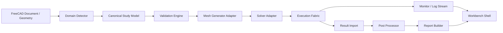
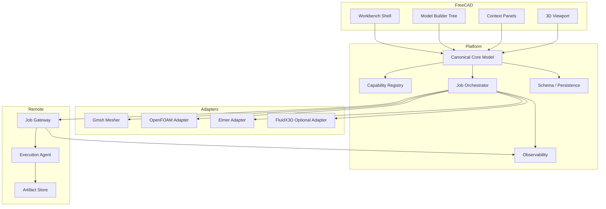
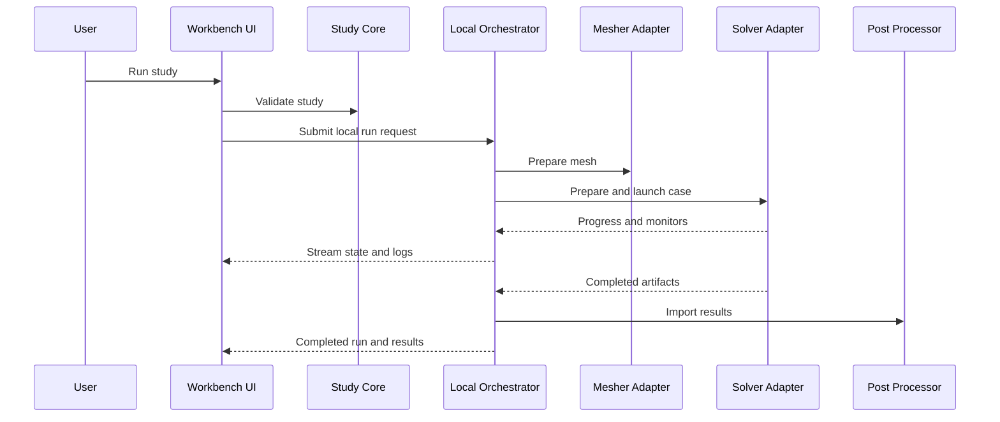
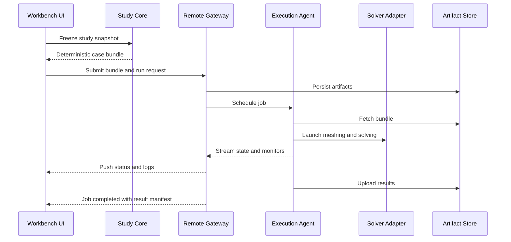
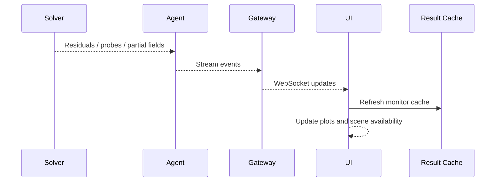

# Flow Studio Enterprise for FreeCAD

## Executive Architecture Summary

Flow Studio Enterprise for FreeCAD is a CAD-embedded simulation platform that keeps FreeCAD's parametric document model at the center while introducing an enterprise-grade simulation architecture around it. The recommended direction is a hybrid Python and C++ workbench in which Python owns workbench registration, scripting, orchestration glue, schema handling, and most UI composition, while C++ incrementally absorbs performance-critical geometry interrogation, topology analysis, volume detection, mesh preparation, and high-frequency result streaming.

The architecture deliberately separates six concerns:

1. `Workbench shell`: FreeCAD-native commands, docking, and task-oriented UX.
2. `Simulation core`: canonical study model, validation, capability discovery, and migration.
3. `Adapters`: mesher and solver-specific translators for OpenFOAM, Elmer, and optional backends.
4. `Execution fabric`: local workers, process orchestration, remote gateway, artifact transport, and monitoring.
5. `Post and reporting`: result import, scenes, plots, comparisons, and reports.
6. `Platform services`: logging, tracing, metrics, plugin registration, and test harnesses.

The recommended v1 is a workbench-first product with:

- FreeCAD document objects for studies, domains, meshes, runs, results, and reports.
- A modern docked desktop shell inspired by FloEFD, Ansys Workbench, COMSOL Model Builder, and SimScale.
- OpenFOAM as the primary CFD backend.
- Elmer as the multiphysics-capable backend.
- Gmsh as the initial general meshing path.
- Local execution plus a pragmatic remote job gateway.
- Deterministic case bundles, structured logs, resumable runs, and headless automation.

FluidX3D remains behind an experimental adapter boundary and is not part of the commercially necessary core path.

---

## A. Product Vision

### What Flow Studio Enterprise is

Flow Studio Enterprise for FreeCAD is an industrial simulation workbench that turns FreeCAD into a simulation-aware engineering cockpit. It is not just a CFD toolbar. It is a long-lived study environment in which parametric CAD, domain extraction, mesh preparation, physics setup, solver execution, remote compute, result comparison, and reporting are coherent parts of one project model.

### Target users

- `Design engineers`: guided setup, robust defaults, automatic fluid detection, and design-study loops close to CAD.
- `CFD analysts`: solver transparency, mesh and numerics control, monitors, diagnostics, and reproducible exportable cases.
- `Thermal engineers`: conjugate heat transfer, electronics abstractions, material libraries, and reportable thermal metrics.
- `Multiphysics engineers`: extensible study nodes, coupled analyses, and backend selection between OpenFOAM and Elmer.
- `Simulation platform admins`: deployment controls, remote execution, security policy, auditability, and automation surfaces.

### What should feel like FloEFD, Ansys, COMSOL, and SimScale

- `FloEFD-like`: simulation stays embedded in the CAD context, fluid volumes can be inferred from design geometry, and setup is guided rather than code-centric.
- `Ansys-like`: the workflow is task-based, validation-rich, and explicit about dependencies between geometry, mesh, solver setup, and runs.
- `COMSOL-like`: one coherent model builder tree spans geometry to results, with strong parameterization and study management.
- `SimScale-like`: execution is location-agnostic, collaboration-aware, and built around solver abstraction and scalable job handling.

### What remains uniquely FreeCAD-native

- Parametric document recompute remains authoritative for design changes.
- Study objects live as FreeCAD document objects, not foreign opaque blobs.
- Python scripting remains a first-class automation surface.
- The workbench respects FreeCAD selection, properties, object tree concepts, and extension ecosystem.

### Product boundaries

`In v1`

- Internal and external flow studies.
- Steady and transient incompressible flow for OpenFOAM.
- Heat transfer and selected multiphysics studies via Elmer.
- Guided geometry prep for fluid domain creation, leak sealing assistance, and enclosure creation.
- Gmsh-based initial mesh path plus adapter contracts for snappyHexMesh-style workflows.
- Local interactive execution and remote gateway execution.
- Result scenes, probes, plots, comparison, and report generation.
- Deterministic case bundles and support bundles.

`Deferred to v2`

- Advanced fault-tolerant automated meshing with industrial-grade repair heuristics in C++.
- Full optimization loops and built-in DOE orchestration.
- Rich collaboration features such as comments, shared dashboards, and organization-level governance.
- Kubernetes-native execution fabric and elastic remote agents.
- High-bandwidth in-situ result streaming from remote clusters.

`Explicitly not copied`

- Proprietary branding, exact screen metaphors, or unbounded feature claims from commercial tools.
- Solver lock-in or opaque black-box numerics.
- Monolithic project files that hide reproducibility details.

---

## B. Research-Based UX Specification

### Main layout

The main shell should use a four-pane engineering cockpit:

- `Left`: Project and Model Builder tree with object status glyphs, dependency badges, and validation markers.
- `Center`: FreeCAD 3D viewport with study-aware overlays, selection filters, and scene presets.
- `Right`: Contextual property and task panel that changes by selected node and workflow stage.
- `Bottom`: Jobs, logs, monitors, diagnostics, and results messages in tabbed panes.
- `Optional`: Study dashboard for run status, KPIs, and design point summaries.

### Navigation model

Support both:

- `Model tree nodes`: `Geometry`, `Topology / Fluid Domains`, `Materials`, `Physics`, `Boundary Conditions`, `Mesh`, `Solver`, `Study`, `Run`, `Results`, `Reports`.
- `Workflow tabs`: compact task tabs for novice and intermediate users, backed by the same nodes.

### Guided workflows

- `Watertight workflow`: automatic fluid volume extraction, direct material assignment, and default meshing.
- `Dirty CAD workflow`: repair hints, contact gaps, leak detection, defeaturing suggestions, and fallback meshing paths.
- `Electronics cooling workflow`: component abstractions, fans, porous regions, thermal resistances, heat sources, and enclosure setup.
- `Rotating machinery workflow`: rotating regions, MRF presets, cyclic interfaces, and shaft or fan models.
- `External aerodynamics workflow`: wind tunnel domain creation, far-field defaults, force monitors, and wake refinement guidance.
- `Conjugate heat transfer workflow`: fluid and solid domains, interface coupling, thermal contacts, and report templates.

### Project schematic and dependency graph

The UI should expose both a tree view and a schematic graph:

- CAD snapshot or live link feeds `Domain Model`.
- Domain model feeds `Mesh Recipe`.
- Physics, materials, and BCs feed `Solver Configuration`.
- Prepared mesh plus solver config produce `Run`.
- Run outputs produce `Result Set`.
- Results feed `Reports`.

### Parameter manager

- Named parameters linked to FreeCAD expressions or standalone study parameters.
- Design points represented as immutable parameter snapshots with inherited defaults.
- Sweep definitions with serial or parallel execution policies.
- Optimization hooks exposed through an automation interface rather than a hard-coded optimizer in v1.

### Results UX

- Result scenes: slices, contours, iso-surfaces, vectors, streamlines, probes, particle traces, and XY plots.
- Comparison mode: run-to-run delta fields, side-by-side scenes, synchronized cameras, KPI tables.
- Report builder: drag-configured sections for geometry summary, setup summary, convergence, plots, and annotated views.

### Collaboration and remote UX

- Submitted jobs table with project, study, target node, owner, queue state, start time, elapsed time, and artifact location.
- Resource panel showing CPU, memory, solver rank count, GPU availability, and disk usage.
- Partial result streaming shown as monitor charts, live residuals, and selectively refreshed scenes.
- Remote targets modeled as named execution profiles rather than ad hoc host strings.

### Error UX

- Geometry repair hints tied to specific bodies, gaps, or leaks.
- Mesh-quality remediation suggestions based on skewness, non-orthogonality, or failed inflation.
- Solver failure explanation summarizing likely causes, last successful phase, and recommended next actions.
- One-click `Collect Support Bundle` packaging logs, schema snapshots, manifest hashes, and validation output.

---

## C. Visual / Design System Spec

- `Framework`: Qt via PySide in the workbench layer, with C++ Qt models for hot paths in v2.
- `Icon strategy`: crisp SVG symbols with solver-neutral semantic icons and backend badges.
- `Theming`: Flow Studio token layer on top of FreeCAD themes.
- `Dark/light`: follow host preference, normalize contrast and paddings in both.
- `Spacing`: 4 px grid, compact but deliberate grouping.
- `Typography`: engineering-first sizing, semibold section headers, readable dense tables.
- `Interaction states`: hover, selected, dirty, invalid, inherited, overridden, running, stale.
- `Loading`: staged progress when available, cancel for safe long-running tasks.
- `Empty states`: always explain missing prerequisite or next action.
- `Tables/property grids`: sorting, filtering, saved layouts, unit-aware inline editing, and row-level validation.

---

## D. Target Tech Stack

### Recommended stack table

| Layer | Recommendation | Why | v1 status |
|---|---|---|---|
| Host integration | FreeCAD workbench in Python plus incremental C++ services | Preserves native integration and scripting while leaving room for performance hotspots | Mandatory |
| Desktop UI | Qt / PySide with model-view patterns, docks, property models | Native FreeCAD fit, mature desktop tooling | Mandatory |
| Geometry access | FreeCAD document model plus OpenCASCADE services | Reuse parametric CAD and shape interrogation | Mandatory |
| Geometry acceleration | C++ service module for topology graphing, leak detection, fluid volume helpers | Performance and robustness on large assemblies | Recommended v2 |
| Meshing abstraction | Python contracts with Gmsh adapter first | Fastest maintainable path | Mandatory |
| Fault-tolerant meshing | snappyHexMesh or similar adapters behind mesh recipe contracts | Better CFD robustness | Recommended v2 |
| Solver adapters | OpenFOAM primary, Elmer secondary, FluidX3D optional and isolated | Meets commercial and multiphysics constraints | Mandatory |
| Local orchestration | Python process manager with bounded worker pools | Good fit for desktop and headless | Mandatory |
| Remote execution | Job gateway service with REST control plus streaming channel | Practical enterprise path | Mandatory |
| Streaming | WebSocket for progress and logs, gRPC for v2 typed streaming | Pragmatic now, scalable later | v1 REST+WS, v2 gRPC |
| Post-processing | VTK data model with ParaView-compatible pipeline export and Qt plots | Industry-compatible result model | Mandatory |
| Persistence | FCStd-linked metadata plus JSON schemas | Preserve document model and deterministic bundles | Mandatory |
| Automation | Python API plus CLI; REST for remote services | Essential for CI, admins, and advanced users | Mandatory |
| Observability | Structured JSON logs, metrics hooks, trace identifiers | Needed for auditability and supportability | Mandatory |

### Layer notes

- `Mandatory for v1`: FreeCAD workbench registration, Python package structure, solver-neutral study schema, OpenFOAM and Elmer adapters, local process manager, remote job gateway, structured logging.
- `Recommended for v2`: C++ geometry prep services, snappyHexMesh path, gRPC control plane, content-addressed artifacts, richer dashboards.
- `Experimental`: standalone shell reuse, immersed-grid meshing, optional GPU solver adapters.

### Vendored upstream references

FlowStudio also keeps a curated set of upstream solver repositories under `src/Mod/FlowStudio/solver_repos` for adapter work, exporter validation, and reproducible backend integration. The current canonical set is documented in `SOLVER_REPOSITORIES.md` and includes OpenFOAM, Elmer, FluidX3D, Raysect, Meep, openEMS, Optiland, and Geant4.

---

## E. Multi-Solver Architecture

### Canonical simulation domain model

- `Project`
- `GeometryReference`
- `GeometrySnapshot`
- `DomainModel`
- `MaterialAssignment`
- `PhysicsDefinition`
- `BoundaryCondition`
- `MeshRecipe`
- `SolverConfiguration`
- `StudyDefinition`
- `RunRequest`
- `RunRecord`
- `ResultSet`
- `ReportDefinition`

### Abstract interfaces

- `GeometryProvider`
- `TopologyDomainDetector`
- `MaterialLibrary`
- `BoundaryConditionModel`
- `MeshGenerator`
- `PhysicsModelCompiler`
- `StudyDefinitionCompiler`
- `SolverRunner`
- `MonitorStream`
- `PostProcessor`
- `ReportGenerator`

### Common across backends

- Geometry and region identity.
- Material metadata and physical property assignment.
- Boundary condition intent.
- Study lifecycle states.
- Resource profiles.
- Result metadata, monitors, and artifact manifests.

### Solver-specific

- File generation formats.
- Numerics controls.
- Turbulence, multiphase, radiation, electromagnetics, and coupling details.
- Parallel launch strategies.
- Reconstruction and post-processing import details.

### Preventing lowest-common-denominator design

Use a two-level contract:

1. `Canonical intent model` for cross-solver workflows and UI consistency.
2. `Capability-specific extension payloads` for advanced features.

Required mechanisms:

- Capability discovery.
- Feature flags.
- Adapter metadata.
- Version compatibility tables.
- Per-solver validation rules.

---

## F. Compute Architecture: Multithread + Multiserver

### Desktop concurrency

- Strict UI-thread isolation.
- Background workers for geometry analysis and validation.
- Separate workers for meshing, solver launch, monitor collection, and result loading.
- Cancellation tokens, typed progress channels, bounded queues, and backpressure.

### Local execution

- Multithread preprocessing where feasible.
- Multi-process solver orchestration for isolation.
- GPU discovery abstraction.
- Resource profile selection by study and solver.

### Remote execution

- Desktop packages a deterministic case bundle and submits it to a gateway.
- Agents unpack, validate, stage artifacts, run meshing and solving, and push status events.
- Uploads and downloads are resumable.
- Logs and monitors are streamed back incrementally.
- Supports remote workstation, on-prem server, HPC gateway, and future Kubernetes execution.

### Execution state machine

- `Draft`
- `Validating`
- `Prepared`
- `Meshing`
- `ReadyToRun`
- `Running`
- `PostProcessing`
- `Completed`
- `Failed`
- `Cancelled`
- `Archived`

### Protocol recommendations

- `Local Python/C++ bridging`: pybind11 or FreeCAD-native bindings.
- `Desktop to service RPC for v1`: REST plus WebSocket.
- `Desktop to service RPC for v2`: gRPC.
- `Artifact transport`: HTTPS multipart upload with content hashes and resumable chunk manifests.
- `Streaming`: WebSocket now, gRPC later.

### Recommended architectures

- `Pragmatic v1`: desktop Python workbench, local Python process manager, Python remote job gateway, Python agents launching native binaries.
- `Scalable v2`: same schemas and adapters, C++ geometry and result services, gRPC control plane, content-addressable artifact store, scheduler abstraction for HPC or Kubernetes.

---

## G. Geometry Prep / CAD-Embedded CFD Workflow

Geometry prep objects should live in the FreeCAD model tree as parametric objects linked to source bodies:

- `DomainDetector`
- `InternalFluidVolume`
- `ExternalFlowDomain`
- `LeakSealOperation`
- `DefeatureSuggestionSet`
- `ContactMap`
- `ThinGapRegion`
- `PorousRegion`
- `RotatingRegion`
- `CompactFanModel`
- `ThermalNetwork`
- `ElectronicsComponent` in v2

Each supports live parametric links, frozen snapshot mode, validation diagnostics, and user override state.

---

## H. Study / Project Model

### Core entities

- `Project`
- `Geometry Snapshot / Live Link`
- `Domain Model`
- `Materials`
- `Physics Nodes`
- `Boundary Conditions`
- `Mesh Recipe`
- `Solver Configuration`
- `Study`
- `Run`
- `Result Set`
- `Report`
- `Parameter Set`
- `Design Point Set`

### Behavior

- Project-level defaults provide materials, units, and policies.
- Study-level overrides specialize physics, mesh, and solver settings.
- Run-level overrides are limited to execution profile, parameter point, or branch metadata.
- Runs are immutable records linked to the study revision that produced them.
- Every run stores study id, schema version, adapter id, solver version, artifact manifest hash, and optionally CAD snapshot hash.

---

## I. Backend-Specific Adapter Design

### OpenFOAM adapter

- Canonical case generation into dictionaries and region-specific folders.
- Programmatic dictionary generation, not ad hoc text replacement.
- Region handling, decomposition, function objects, probes, monitors, reconstruction, and custom solver support path.

### Elmer adapter

- SIF generation from canonical study plus adapter extension block.
- Mesh conversion path is explicit and versioned.
- Multiphysics opportunities for thermal, structural, electrostatics, and coupled workflows.
- MPI launch profile is part of execution configuration.

### FluidX3D optional adapter

FluidX3D must remain isolated due to licensing and commercial constraints.

- Best fit: interactive preview, exploratory incompressible flow class, or GPU-heavy optional path.
- Fallback when unavailable: route to OpenFOAM or a future commercial-safe GPU CFD backend.
- No UI, schema, or core service should depend on FluidX3D-specific concepts.

---

## J. File / Data Architecture

```text
project_root/
  project_manifest.json
  studies/
    <study_id>/
      study.json
      parameters.json
      mesh_recipe.json
      runs/
        <run_id>/
          manifest.json
          case_bundle/
          logs/
          results/
          reports/
          tmp/
  cache/
  support/
```

- Immutable: case bundles, manifests, imported result snapshots, support bundles.
- Mutable: draft study metadata, active logs, transient progress caches.
- Temporary files live under run-scoped `tmp/`.
- Crash recovery relies on write-ahead manifests and atomic rename on completion.

---

## K. Quality Engineering / Test Strategy

- Unit tests for schema, validation, manifests, logging, and adapters.
- Contract tests for each solver adapter.
- Geometry regression tests for fluid volume and topology classification.
- Mesh regression tests with quality metrics.
- Golden-case simulation tests with small deterministic benchmark cases.
- GUI workflow tests for key guided flows.
- Job orchestration tests for retries, cancellation, and recovery.
- Remote execution tests for submission and streaming.
- Performance and soak tests.
- Compatibility matrix tests for supported solver versions.
- Migration tests for saved projects.

CI design:

- PR pipeline: lint, unit, contract, schema, and light workflow tests.
- Nightly pipeline: golden solver runs, geometry regressions, remote execution tests, and performance comparisons.
- Dedicated headless regression command for adapter-matrix UI logic:

```powershell
PYTEST_DISABLE_PLUGIN_AUTOLOAD=1 PYTHONNOUSERSITE=1 \
python -m pytest src/Mod/FlowStudio/flow_studio/tests/test_enterprise_adapter_matrix.py -q
```

- Developer one-click equivalent in VS Code tasks: `FlowStudio: Test Adapter Matrix (Headless)`.
- Dedicated GitHub Actions workflow: `FlowStudio Adapter Matrix CI` in `.github/workflows/flowstudio_adapter_matrix_ci.yml`.

---

## L. Security / Deployment / Packaging

- Windows and Linux are mandatory targets.
- macOS is future optional.
- Remote agents support SSH, TLS, or token auth based on deployment mode.
- Secrets are stored outside project files using OS credential stores or deployment-managed secrets.
- Plugin trust model requires signed or explicitly trusted plugins for remote execution-impacting extensions.
- Offline enterprise deployments should support mirrored dependency repositories and air-gapped agent installation.

---

## M. Implementation Roadmap

1. `Foundation`: canonical schemas, logging, adapter contracts, local orchestration boundaries.
2. `Workbench shell`: model tree, property framework, study dashboard, diagnostics shell.
3. `Core workflows`: internal and external CFD, OpenFOAM path, Gmsh path, result scenes.
4. `Remote execution`: gateway, agent, artifact manifests, streaming monitors.
5. `Multiphysics expansion`: Elmer-driven thermal and coupled studies.
6. `Hardening`: migration tooling, compatibility tables, performance work, admin tooling.

Highest-risk unknowns:

- Large-assembly geometry prep complexity.
- Dirty CAD robustness expectations.
- Result import performance for transient or large-volume cases.
- Schema and document-object synchronization reliability.

---

## N. Repository / Codebase Structure

```text
src/Mod/FlowStudio/
  Init.py
  InitGui.py
  docs/
    ARCHITECTURE.md
  flow_studio/
    __init__.py
    commands.py
    enterprise/
      __init__.py
      bootstrap.py
      core/
      adapters/
      services/
      observability/
      testing/
  Resources/
```

Layering rules:

- `core` depends on standard library only where feasible.
- `adapters` depend on `core`.
- `services` depend on `core` and `adapters`.
- UI and FreeCAD integration depend on `services` and `core`.
- No adapter imports from UI packages.
- No persistence code embedded in widgets.

---

## O. Output Required Artifacts

### Detailed module breakdown

- `enterprise.core.domain`: canonical entities, enums, manifests, and schema metadata.
- `enterprise.core.contracts`: typed interfaces for geometry, mesh, solver, monitoring, and reporting.
- `enterprise.adapters.base`: adapter metadata and common runner skeleton.
- `enterprise.adapters.openfoam`: OpenFOAM case and execution skeleton.
- `enterprise.adapters.elmer`: Elmer SIF and execution skeleton.
- `enterprise.services.jobs`: local and remote job orchestration contracts and in-memory service.
- `enterprise.services.remote_api`: remote submission DTOs and service facade.
- `enterprise.observability.logging`: structured logging and trace context helpers.
- `enterprise.testing.harness`: reusable adapter and service test harness.

### Data-flow diagram



### Component diagram



### Sequence diagrams

Local run:



Remote run:



Result streaming:



### Example interface definitions / pseudocode

```python
class SolverRunner(Protocol):
    def capabilities(self) -> CapabilitySet: ...
    def validate(self, request: RunRequest) -> list[ValidationIssue]: ...
    def prepare_case(self, context: PreparedStudyContext) -> PreparedCase: ...
    def launch(self, prepared_case: PreparedCase) -> JobHandle: ...
    def stream(self, handle: JobHandle) -> Iterable[JobEvent]: ...
    def collect_results(self, handle: JobHandle) -> ResultSet: ...
```

### Example project schema

```json
{
  "schema_version": "1.0.0",
  "project_id": "project-demo",
  "studies": [
    {
      "study_id": "study-cfd-001",
      "solver_family": "openfoam",
      "geometry_source": {
        "mode": "live_link",
        "document_object": "Body"
      },
      "mesh_recipe": {
        "generator_id": "gmsh.default",
        "global_size": 0.002
      },
      "runs": [
        {
          "run_id": "run-0001",
          "state": "Completed",
          "manifest_hash": "sha256:example"
        }
      ]
    }
  ]
}
```

### Migration plan

1. Preserve legacy analysis containers and command entry points.
2. Add enterprise package and stable contracts in parallel.
3. Introduce new study object factories and migrate new workflows to canonical schemas.
4. Add legacy-to-canonical adapters for old FlowStudio objects.
5. Switch solver execution to orchestrator-managed paths.
6. Deprecate direct solver runners only after parity and migration tooling exist.

### Final recommendation

Adopt the hybrid workbench-first architecture described here, with OpenFOAM and Elmer as the mandatory industrial backbone, Gmsh as the initial mesh path, a canonical study schema as the center of gravity, and a remote job gateway designed from day one. Use FreeCAD document objects for live engineering interaction, but make deterministic exported study bundles the contract for execution and reproducibility. Keep FluidX3D isolated as optional and replacement-ready.

---

## P. Code Generation Phase

The following starter scaffolding is implemented in the repository and maps directly to the requested architecture elements:

- FreeCAD workbench bootstrap:
  - `flow_studio/enterprise/bootstrap.py`
  - `flow_studio/enterprise/__init__.py`
- Core domain model interfaces and canonical entities:
  - `flow_studio/enterprise/core/domain.py`
  - `flow_studio/enterprise/core/contracts.py`
  - `flow_studio/enterprise/core/serialization.py`
  - `flow_studio/enterprise/core/sidecar.py`
- Solver adapter base classes and concrete skeletons:
  - `flow_studio/enterprise/adapters/base.py`
  - `flow_studio/enterprise/adapters/openfoam.py`
  - `flow_studio/enterprise/adapters/elmer.py`
  - `flow_studio/enterprise/adapters/fluidx3d.py` (optional/isolated licensing boundary)
- Remote job service skeleton and execution services:
  - `flow_studio/enterprise/services/jobs.py`
  - `flow_studio/enterprise/services/remote_api.py`
  - `flow_studio/enterprise/services/process_executor.py`
  - `flow_studio/enterprise/services/execution_facade.py`
  - `flow_studio/enterprise/services/run_store.py`
- Structured logging setup:
  - `flow_studio/enterprise/observability/logging.py`
- Test harness and focused tests:
  - `flow_studio/enterprise/testing/harness.py`
  - `flow_studio/tests/test_enterprise_contracts.py`
  - `flow_studio/tests/test_enterprise_actions.py`
  - `flow_studio/tests/test_enterprise_bridge.py`
  - `flow_studio/tests/test_enterprise_remote.py`
  - `flow_studio/tests/test_enterprise_bootstrap.py`
  - `flow_studio/tests/test_enterprise_adapter_matrix.py`

Implementation guardrails preserved:

- No monolithic coupling between UI, adapters, and persistence.
- Solver-neutral core contracts with adapter extension payloads.
- FluidX3D remains optional/non-core-safe and isolated.
- Headless automation path is available via Python + pytest command line and CI workflow.
