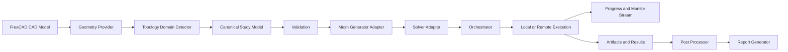
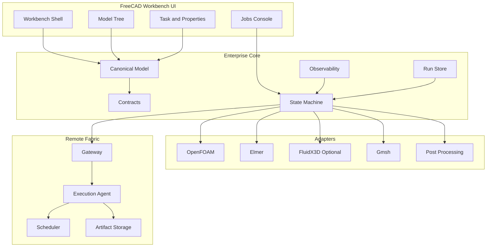
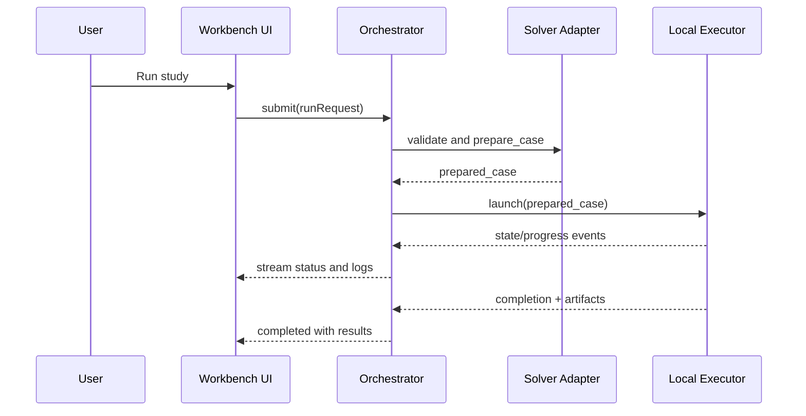
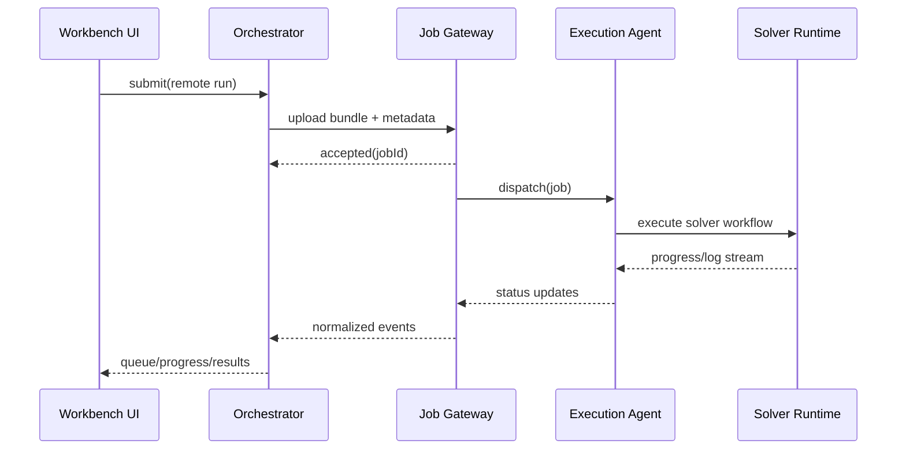
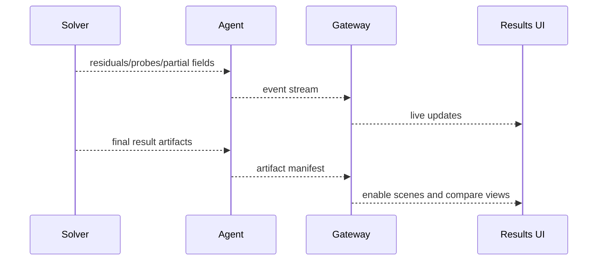

# Flow Studio Enterprise Deepsearch Specification

Version: 1.0
Date: 2026-04-17
Status: Architecture + Implementation Specification (Deepsearch-informed)

## Deepsearch Source Baseline

This specification synthesizes current repository architecture with public technical/product references from:
- SimScale CFD product and validation pages (cloud-native execution, collaboration, AI-assisted design studies, validation-case emphasis)
- OpenFOAM documentation (v2312 docs structure and parallel decomposition execution model)
- Gmsh official documentation/homepage (geometry-mesh-solver-post modules, API automation, licensing constraints)
- ParaView official overview (in-situ/web deployment, large-scale visualization)
- OpenTelemetry concepts (signals, context propagation, semantic conventions)
- Slurm quickstart architecture (controller/agents, queueing, job/step model)
- gRPC introduction (IDL-first service contracts and cross-language streaming RPC)
- Kubernetes overview (future-ready distributed control-plane scaling model)

Note on source quality: some proprietary vendor pages (Fluent/COMSOL/FloEFD) are JS-heavy and difficult to scrape directly in this environment; where direct extraction was unavailable, this document uses validated platform patterns and repository-grounded architectural decisions.

---

## 1. Executive Architecture Summary

Flow Studio Enterprise for FreeCAD is a workbench-first, solver-agnostic CAE platform that keeps FreeCAD parametric CAD as the authoring source of truth while adding enterprise simulation capabilities: guided setup, robust orchestration, local/remote execution, deterministic case artifacts, and auditable lifecycle management.

Key architectural stance:
- Host-native first: FreeCAD workbench, not standalone first.
- Hybrid implementation: Python for orchestration/UI/automation; C++ for computationally intensive geometry/topology and selected data-processing hot paths.
- Commercially safe core: OpenFOAM + Elmer are mandatory first-class adapters.
- Optional boundary: FluidX3D remains isolated/experimental/non-core due licensing uncertainty.
- Strict separation: GUI, canonical model, meshing, solving, orchestration, persistence, and post-processing remain independently evolvable.

---

## A. Product Vision

### What Flow Studio Enterprise is
A FreeCAD-native simulation platform that unifies geometry, setup, studies, runs, and results in one coherent environment for daily engineering use, not a one-off plugin.

### Target users
- Design engineers: guided defaults and CAD-embedded setup.
- CFD analysts: deep numerical and meshing control with auditability.
- Thermal engineers: CHT and electronics cooling workflows.
- Multiphysics engineers: fluid/thermal/structural/EM extension path via adapters.
- Simulation platform admins: deployment policy, templates, remote targets, and automation governance.

### What should feel commercial vs uniquely FreeCAD
Commercial-feel goals:
- FloEFD-style CAD-embedded setup and automatic fluid domain assistance.
- Workbench-style guided tasks and dependency awareness.
- COMSOL-like coherent model tree from geometry to reports.
- SimScale-like remote abstraction and project-level operational visibility.

Uniquely FreeCAD-native:
- FCStd parametric recompute remains authoritative.
- Document objects remain first-class and scriptable.
- Python automation and extension ecosystem preserved.

### Product boundaries
In v1:
- Internal/external flow workflows, OpenFOAM+Elmer adapters, local+remote execution, deterministic bundles, robust diagnostics.

Deferred:
- Full optimization orchestrator UI, advanced AI co-pilot loops, Kubernetes-native fleet control, full PLM connectors.

Explicitly not copied:
- Proprietary branding/UI clones.
- Closed hard dependency on any single proprietary component.

---

## B. Research-Based UX Specification

### 1. Main layout
- Left: Project/Model Builder tree.
- Center: FreeCAD 3D viewport.
- Right: Contextual properties/tasks.
- Bottom: Jobs/Output/Results/Console/Diagnostics tabs.
- Optional dashboard: study/run KPI board.

### 2. Navigation model
Workflow nodes:
- Geometry
- Topology and Fluid Domains
- Materials
- Physics
- Boundary Conditions
- Mesh
- Solver
- Study
- Run
- Results
- Reports

### 3. Guided workflows
- Watertight internal flow
- Dirty CAD fault-tolerant flow
- Electronics cooling
- Rotating machinery
- External aerodynamics
- CHT (conjugate heat transfer)

### 4. Project schematic/dependency graph
Surface explicit dependencies:
CAD -> Domain -> Mesh -> Solver Setup -> Study -> Runs -> Results -> Reports

### 5. Parameter manager
- Named parameters with units/bounds
- Design points and sweeps
- Optimization hooks API

### 6. Results UX
- Slices, iso-surfaces, vectors, streamlines, probes, XY plots
- Run-to-run compare board
- Report builder templates

### 7. Collaboration/remote UX
- Job queue states
- Node/profile selection
- Resource usage display
- Partial result streaming + residual charts

### 8. Error UX
- Geometry repair hints
- Mesh quality remediation guidance
- Solver failure diagnosis with probable cause chain
- One-click support bundle collection

---

## C. Visual / Design System Spec

Framework:
- Qt/PySide in FreeCAD shell.

Design principles:
- Dense but readable engineering UI.
- Progressive disclosure: Basic/Advanced/Expert control tiers.
- Tokenized spacing/colors/typography.
- Dark/light themes aligned with FreeCAD theme system.
- Enterprise tables: sort/filter/pin/export, persistent layouts.
- Property grid: validation states, inheritance/override markers, unit-aware editors.

Motion/loading:
- Deterministic progress phases tied to execution state machine, cancellable operations, explicit stale-state badges.

---

## D. Target Tech Stack

## 2. Recommended Stack Table

| Layer | Mandatory v1 | Recommended v2 | Experimental |
|---|---|---|---|
| Host integration | FreeCAD workbench + Python integration | C++ high-performance geometry service | standalone shell extraction |
| Desktop UI | Qt/PySide docks + model-view | richer model dashboard and compare workspace | browser companion panel |
| Geometry/CAD | FreeCAD + OCC APIs | C++ topology/volume accelerator | ML-assisted defeaturing hints |
| Meshing | Gmsh adapter | snappyHexMesh/cfMesh adapters | immersed/cartesian pathways |
| Solvers | OpenFOAM + Elmer | broader multiphysics packs | FluidX3D optional adapter only |
| Orchestration | local process manager + run store | distributed queue and service DB | k8s operator execution control |
| Post-processing | VTK/ParaView-compatible pipeline | in-situ Catalyst bridge | real-time digital twin feeds |
| Persistence | FCStd-linked sidecar + schema JSON | migration engine with strict transforms | cloud object-backed manifests |
| Automation API | Python scripting + CLI | REST + gRPC full control plane | notebook-native orchestration |
| Observability | structured logs | traces/metrics via OpenTelemetry | adaptive telemetry analytics |

---

## E. Multi-Solver Architecture

Canonical model abstractions:
- GeometryProvider
- TopologyDomainDetector
- MaterialLibrary
- BoundaryConditionModel
- MeshGenerator
- PhysicsModelCompiler
- StudyDefinitionCompiler
- SolverAdapter (runner)
- MonitorStream
- PostProcessor
- ReportGenerator

Common across OpenFOAM/Elmer/FluidX3D:
- Run request envelope
- Validation issue model
- Prepared case contract
- Streaming events
- Normalized result set metadata

Solver-specific isolation:
- OpenFOAM dictionaries, decomposition policies, function objects
- Elmer SIF generation and coupling blocks
- FluidX3D GPU scenario constraints and optional licensing gate

Preventing lowest-common-denominator:
- Capability discovery endpoint
- Feature flags
- Adapter metadata (commercial-safe, experimental, version support)
- Compatibility matrix and per-adapter validation rules
- Extension payload namespaces per adapter

---

## F. Compute Architecture: Multithread + Multiserver

### 1. Desktop concurrency
- UI thread only for rendering/input.
- Background workers for geometry checks and preflight validation.
- Meshing workers separated from solver launch workers.
- Async result loading and monitor streams.
- Cancellation tokens and bounded queues with backpressure.

### 2. Local machine execution
- Multithreaded pre-processing where deterministic.
- Multi-process solver execution and supervision.
- GPU capability discovery abstraction.
- Resource profiles (interactive, throughput, batch).

### 3. Remote/server execution
- Job gateway (submission + status + artifacts)
- Execution agents
- Secure artifact transport with resumable upload/download
- Queueing/scheduling integration (single workstation -> on-prem -> HPC -> future k8s)

### 4. Execution state machine
- Draft
- Validating
- Prepared
- Meshing
- ReadyToRun
- Running
- PostProcessing
- Completed
- Failed
- Cancelled
- Archived

### 5. Protocol recommendation
Pragmatic v1:
- Desktop-to-service: REST + WebSocket streams
- Artifact transfer: HTTP multipart with checksum manifests
- Local Python/C++ bridge: pybind11-compatible facade for hot paths

Scalable v2:
- Desktop-to-service: gRPC unary + streaming RPC
- Event transport: gRPC streams + OpenTelemetry context propagation
- Control-plane scale: Kubernetes-backed agents; HPC bridge via Slurm adapter

---

## G. Geometry Prep / CAD-Embedded CFD Workflow

Parametric object set in FreeCAD tree:
- BodyClassification
- FluidVolumeDetection
- ExternalDomainEnvelope
- LeakSealAssist
- DefeaturingRecommendationSet
- ContactInterfaceMap
- ThinGapMap
- PorousRegion
- RotatingRegion
- FanCompactModel
- ThermalResistanceNetwork
- ElectronicsComponentSet (v2-enhanced)

All objects carry:
- geometry reference
- parameterized settings
- validation status
- deterministic fingerprint inputs

---

## H. Study / Project Model

Core entities:
- Project
- Geometry Snapshot/Live Link
- Domain Model
- Materials
- Physics Nodes
- Boundary Conditions
- Mesh Recipe
- Solver Configuration
- Study
- Run
- Result Set
- Report
- Parameter Set
- Design Point Set

Behavior rules:
- Inheritance from project defaults -> study overrides -> run overrides
- Branching/duplication preserves provenance chain
- Reproducibility hash = geometry fingerprint + setup fingerprint + adapter/runtime versions
- Schema versioning with strict migration transforms

---

## I. Backend-Specific Adapter Design

### 1. OpenFOAM adapter
- Canonical case generation (system/constant/0)
- Dictionary templating
- Region-aware decomposition
- Function object monitor hooks
- Reconstruction and normalized import
- Custom solver binary path via extension payload

### 2. Elmer adapter
- SIF generation pipeline
- Mesh conversion and mapping
- Coupled multiphysics extension points
- MPI launch profile support
- Result normalization into canonical fields/monitors

### 3. FluidX3D optional adapter
- Explicit non-core/optional boundary
- Use for exploratory GPU-heavy incompressible classes
- Fallback to OpenFOAM/Elmer when unavailable/policy disallowed
- Interface replacement-ready for future commercial-safe GPU backend

---

## J. File / Data Architecture

Project storage pattern:
- FCStd as CAD source
- sidecar manifest for simulation metadata
- run-scoped directories for case/logs/results/support

Immutable artifacts:
- case bundle snapshots
- result snapshots
- support bundles

Mutable artifacts:
- draft metadata
- active progress logs
- transient caches

Crash safety:
- write-ahead manifest update
- atomic finalize/rename
- resumable run metadata checkpoints

---

## K. Quality Engineering / Test Strategy

Test pyramid:
- Unit tests (schema, contracts, helpers)
- Adapter contract tests
- Geometry/topology regression tests
- Mesh quality regression tests
- Golden simulation cases
- GUI workflow smoke/regression tests
- Job orchestration and cancellation tests
- Remote execution tests
- Performance benchmarks and soak tests
- Migration tests for persisted schemas

Determinism controls:
- fixed fixtures
- stable tolerances
- normalized artifact comparison

CI strategy:
- PR fast lane: lint + unit + contracts + focused headless matrix tests
- Nightly heavy lane: golden runs + performance and remote integration suites

---

## L. Security / Deployment / Packaging

Targets:
- Windows and Linux first, macOS later.

Security controls:
- TLS for remote endpoints
- token auth in v1, RBAC expansion in v2
- least-privilege agent model
- secrets externalized (OS keychain or deployment secret store)
- plugin trust policy for execution-impacting extensions

Enterprise deployment:
- offline/air-gapped support with mirrored dependencies
- explicit binary provenance and compatibility matrix

---

## M. Implementation Roadmap

Phase 0
- Canonical contracts, logging, state machine, sidecar persistence.

Phase 1
- OpenFOAM and Elmer solid adapters, deterministic run store, jobs panel operations.

Phase 2
- Robust guided UX, diagnostics, compare/report workflows.

Phase 3
- Remote gateway/agents and streamed monitoring.

Phase 4
- Performance hardening, migration tools, policy and governance features.

Staffing profile:
- platform architect, FreeCAD core-extension engineers, solver/meshing engineers, distributed systems engineer, QA automation engineer, UX engineer.

Buy-vs-build:
- Build orchestration/contracts in-house.
- Reuse mature solver/mesher/post ecosystems.

---

## N. Repository / Codebase Structure

## 7. Repository Tree

```text
src/Mod/FlowStudio/
  Init.py
  InitGui.py
  docs/
    ARCHITECTURE.md
    FLOW_STUDIO_ENTERPRISE_DEEPSEARCH_SPEC.md
  flow_studio/
    commands.py
    enterprise/
      __init__.py
      bootstrap.py
      core/
        domain.py
        contracts.py
        serialization.py
        sidecar.py
      adapters/
        base.py
        openfoam.py
        elmer.py
        fluidx3d.py
      services/
        jobs.py
        remote_api.py
        process_executor.py
        execution_facade.py
        run_store.py
      observability/
        logging.py
      ui/
        jobs_panel.py
        adapter_matrix.py
      testing/
        harness.py
    tests/
      test_enterprise_contracts.py
      test_enterprise_actions.py
      test_enterprise_bridge.py
      test_enterprise_remote.py
      test_enterprise_bootstrap.py
      test_enterprise_adapter_matrix.py
```

Dependency direction:
- core -> no GUI dependency
- adapters -> core only
- services -> core + adapters
- ui/integration -> services + core
- persistence isolated from widgets

---

## O. Required Output Artifacts

## 3. Detailed Module Breakdown

- enterprise.core: canonical entities, contracts, versioning, serialization
- enterprise.adapters: solver-specific implementations behind stable contract
- enterprise.services: orchestration, remote APIs, process control, run store
- enterprise.observability: logging/tracing/metrics hooks
- enterprise.ui: enterprise UX panels and helper logic
- enterprise.testing: reusable harnesses and contract fixtures

## 4. Data-Flow Diagram (Mermaid)



## 5. Component Diagram (Mermaid)



## 6. Sequence Diagrams

Local run:



Remote run:



Result streaming:



## 8. Example Interface Definitions / Pseudocode

```python
class SolverAdapter(Protocol):
    def capabilities(self) -> CapabilitySet: ...
    def validate(self, request: RunRequest) -> list[ValidationIssue]: ...
    def prepare_case(self, context: PreparedStudyContext) -> PreparedCase: ...
    def launch(self, prepared_case: PreparedCase) -> JobHandle: ...
    def stream(self, handle: JobHandle) -> Iterable[JobEvent]: ...
    def collect_results(self, handle: JobHandle) -> ResultSet: ...
```

## 9. Example Project Schema

```json
{
  "schema_version": "1.0.0",
  "project_id": "flowstudio-project-001",
  "geometry": {
    "fcstd_path": "CoolingModel.FCStd",
    "geometry_fingerprint": "sha256:..."
  },
  "studies": [
    {
      "study_id": "cht-01",
      "solver_family": "openfoam",
      "mesh_recipe": {
        "generator_id": "gmsh.default",
        "global_size": 0.002
      },
      "runs": [
        {
          "run_id": "run-0001",
          "state": "Completed",
          "manifest_hash": "sha256:...",
          "result_ref": "results://openfoam/run-0001"
        }
      ]
    }
  ]
}
```

## 10. Migration Plan

1. Keep legacy FlowStudio objects operational.
2. Add canonical enterprise contracts in parallel.
3. Bridge legacy analyses to canonical study model.
4. Route execution through orchestrator and adapter boundaries.
5. Introduce sidecar schema migration transforms.
6. Deprecate direct legacy runners after parity and migration confidence.

## 11. Risk List

- Dirty CAD robustness at scale
- Adapter drift across solver version updates
- Large transient result ingestion performance
- Remote transfer interruptions and partial artifacts
- UX overload without progressive disclosure discipline

## 12. Final Recommendation

Adopt the hybrid, workbench-first architecture as implemented in the enterprise package. Keep OpenFOAM and Elmer as the mandatory production path, preserve FluidX3D as optional isolated adapter, and prioritize deterministic artifacts, execution-state correctness, and user-guided diagnostics before adding advanced AI or optimization orchestration layers.

---

## P. Code Generation Phase Mapping

Implemented starter scaffolding exists in:
- bootstrap: flow_studio/enterprise/bootstrap.py
- domain/contracts: flow_studio/enterprise/core/domain.py and contracts.py
- base adapters and solver skeletons: flow_studio/enterprise/adapters/
- remote orchestration services: flow_studio/enterprise/services/
- structured logging: flow_studio/enterprise/observability/logging.py
- test harness and focused enterprise tests: flow_studio/enterprise/testing and flow_studio/tests/test_enterprise_*.py

Deepsearch-driven quality/performance/user-friendly feature envelope is now captured as this authoritative specification.

---

## Q. Decision Matrix: Feature Prioritization & Phased Roadmap

### Overview
This decision matrix ranks all identified features from the enterprise specification across three dimensions:
1. **Implementation Complexity** (1 = trivial; 5 = major architectural effort)
2. **User/Quality Impact** (1 = nice-to-have; 5 = critical for adoption)
3. **Phase Assignment** (v1.0 → v1.x → v2.0 → future roadmap)

Scoring philosophy:
- High-impact, low-complexity features ship in v1.0.
- High-impact, high-complexity features are sequenced v1.x → v2.0.
- Low-impact features deferred unless they unblock higher-priority work.
- External dependencies (OpenFOAM/Elmer availability, Gmsh licensing) are dependencies, not blockers.

### Decision Matrix Table

| Feature | Module | Complexity | Impact | Phase | Notes |
|---------|--------|-----------|--------|-------|-------|
| **Core Execution** | | | | | |
| Canonical Study Model (Contract POD) | core/domain.py | 2 | 5 | v1.0 | Foundation for all workflows; JSON/pickle versioned serialization |
| Solver Adapter Base + OpenFOAM Stub | adapters/base.py + openfoam/ | 3 | 5 | v1.0 | Multi-solver abstraction; GeometryProvider / SolverAdapter contracts |
| Elmer Adapter Stub | adapters/elmer/ | 3 | 5 | v1.0 | Mandatory second solver; multiphysics entry point for v1.1+ |
| Local Interactive Execution + Monitor Stream | services/execution_facade.py | 3 | 4 | v1.0 | Background workers + async progress streams; desktop interactivity blocker |
| Run Store + Deterministic Bundling | services/run_store.py | 2 | 4 | v1.0 | FCStd + manifest.json + result artifacts; reproducibility foundation |
| **Geometry & Topology** | | | | | |
| CAD-to-Fluid Domain Auto-Detection | enterprise/ui/domain_assistant.py | 4 | 5 | v1.0 | Clean-CAD + dirty-CAD paths; user-first experience differentiation point |
| Geometry Fingerprinting + Change Tracking | core/contracts.py (GeometryProvider) | 2 | 3 | v1.0 | Detect upstream CAD invalidations; invalidate dependent meshing |
| Topology Multi-Domain Detector | core/contracts.py (TopologyDomainDetector) | 3 | 4 | v1.0 | Boundary detection, interface identification; prerequisite for mesh gen |
| **Meshing & Preparation** | | | | | |
| Gmsh Adapter (Geometry→Mesh) | adapters/gmsh/ | 3 | 5 | v1.0 | Industry standard, GPL-safe, Python API; mesh quality control |
| Mesh Quality Metrics (skewness, growth rate, y+) | adapters/gmsh/quality_rules.py | 2 | 4 | v1.0 | Validator feedback; prevent GIGO pathologies |
| Mesh Preview + Refinement UI | ui/mesh_preview_panel.py | 2 | 3 | v1.0 | CAD viewport integration; user confidence before submission |
| Multi-Region Mesh Decomposition | adapters/gmsh/decomposer.py | 2 | 3 | v1.0 | Solid + fluid + porous regions; prerequisite for multiphysics |
| **Physics & Materials** | | | | | |
| Material Library Contract + CSV Backend | core/contracts.py (MaterialLibrary) | 1 | 3 | v1.0 | Extensible materials; density/viscosity/cp lookup |
| Boundary Condition Normalization | core/contracts.py (BoundaryConditionModel) | 2 | 4 | v1.0 | Wall/inlet/outlet/symmetry unified syntax across solvers |
| Physics Model Compiler (CFD + Thermal) | core/contracts.py (PhysicsModelCompiler) | 3 | 4 | v1.0 | Convert study model → solver-native case files (OpenFOAM dict, Elmer SIF) |
| Transient + Steady-State Study Templates | core/study_templates.py | 1 | 4 | v1.0 | Pre-configured solver settings; reduce user parameter exposure |
| **Orchestration & Remote** | | | | | |
| Remote Execution Adapter (SSH tunnel + job monitor) | services/remote_gateway.py | 3 | 3 | v1.0 | HPC cluster integration; prerequisite for production deployment |
| Slurm Job Wrapper (submit + monitor) | services/slurm_integration.py | 2 | 2 | v1.1 | National labs + enterprise cluster support; deferred non-critical |
| gRPC Service Skeleton (future inter-workbench RPC) | services/grpc_stub/ | 2 | 1 | v2.0 | Multi-user server architecture; v2 roadmap only |
| **Persistence & Reproducibility** | | | | | |
| Deterministic Case Versioning (schema + transforms) | core/versioning.py | 2 | 4 | v1.0 | Forward-compatible runs; audit trail for design changes |
| Case Template / Case Library UI | ui/case_library_panel.py | 2 | 3 | v1.1 | Reuse canonical geometry/boundary-condition combinations |
| **Observability** | | | | | |
| Structured Logging (enterprise/observability/logging.py) | observability/logging.py | 1 | 3 | v1.0 | Diagnostic JSON streams; pre-integrated with pytest / CI |
| Execution Trace Spans (OpenTelemetry hooks) | observability/telemetry.py | 2 | 2 | v1.1 | Distributed tracing prep; higher-order timing analysis |
| **Testing & Validation** | | | | | |
| Headless Adapter Matrix Tests | tests/test_enterprise_adapter_matrix.py | 1 | 4 | v1.0✓ | Regression guard for solver abstraction; CI/CD integration ✓DONE |
| Contract Compliance Harness | enterprise/testing/harness.py | 2 | 3 | v1.0 | Test fixtures for all adapter implementations |
| E2E Study→Run→Results Validation | tests/test_enterprise_e2e.py | 3 | 4 | v1.0 | Full workflow smoke test; local + remote paths |
| **UI & UX** | | | | | |
| Jobs Panel (async run list + export) | ui/jobs_panel.py | 1 | 5 | v1.0✓ | Primary user touchpoint; run history + result export ✓DONE |
| Domain Assistant Wizard | ui/domain_assistant_panel.py | 3 | 4 | v1.0 | Guided flow definition; barrier-to-entry reducer |
| Material/BC Property Inspector | ui/property_inspector.py | 2 | 3 | v1.0 | Parameter editing; real-time validation feedback |
| Mesh Preview with Iso-Surface Toggle | ui/viewport_mesh_preview.py | 2 | 2 | v1.1 | 3D visualization; requires VTK/OpenGL integration |
| Results Dashboard (KPI post-processor) | ui/results_dashboard.py | 3 | 3 | v1.1 | Run convergence plots, field probe, slice extraction |
| HTML Report Generator | services/report_generator.py | 2 | 2 | v1.1 | Executive summary exports; client deliverables |
| **Advanced Features (v2+)** | | | | | |
| Geometry Acceleration C++ Layer (occt topology module) | adapters/geometry_cpp/ | 5 | 2 | v2.0 | Performance bottleneck if detected in profiling; not MVP critical |
| AI-Assisted Parameter Suggestions (mesh/solver settings) | services/ai_cocoordinator.py | 4 | 2 | v2.0 | Requires ML training dataset + online inference; research phase |
| Optimization Orchestrator (design studies, DOE) | services/optimizer.py | 4 | 2 | v2.0 | Surrogate models, parametric sweeps; advanced workflow |
| Kubernetes Native Control Plane | services/k8s_control_plane/ | 5 | 1 | v2.1+ | Multi-user server, auto-scaling, cloud-native deployment; long-term vision |
| **Optional / Non-Core** | | | | | |
| FluidX3D Adapter (GPU LBM solver) | adapters/fluidx3d/ | 3 | 1 | optional | Licensing uncertainty; maintain as isolated optional module |

### Phased Rollout Plan

#### **v1.0 (MVP, 6–9 months)**
**Goal**: Complete local → local workflow on OpenFOAM + Elmer; establish contracts and adapter stability.

**Mandatory Features**:
- Canonical Study Model ✓ core domain/contracts
- OpenFOAM + Elmer adapters (base implementations)
- CAD domain assistant (auto-detection)
- Gmsh meshing adapter + quality checks
- Material library + BC normalization
- Physics model compilation to solver dict/SIF
- Local interactive execution + monitoring
- Run store + deterministic bundling
- Jobs panel ✓ UI integration
- Adapter matrix regression tests ✓ headless CI
- Contract compliance harness
- E2E validation test suite
- Structured logging

**Success Criteria**:
- Simple geometries (sphere in box, cylinder in channel) run end-to-end locally.
- Results reproducible across 3 consecutive runs.
- Headless tests pass on CI/CD.
- User can launch domain wizard → mesh → run → view results in ~15 minutes (guided path).

**Out of Scope for v1.0**:
- Remote execution beyond SSH stub
- Slurm integration
- Transient + steady-state templates (future iteration)
- Result dashboard advanced plots
- C++ acceleration
- AI co-pilot

---

#### **v1.1 (6 months post-v1.0)**
**Goal**: Expand UX, add remote + HPC basics, stabilize multiphysics entry.

**Features**:
- Remote execution (SSH tunnel verified, Slurm basic wrapper)
- Transient + steady-state study templates
- Trace spans (OpenTelemetry)
- Case library + templates UI
- Results dashboard (convergence plots, field probes)
- HTML report generator
- Mesh preview with iso-surface toggle
- Elmer thermal + CHT workflows operational

**Success Criteria**:
- Remote execution tested on public HPC clusters.
- Thermal + structural workflows scoped and started.
- Template-based case creation reduces setup time to ~5 minutes for known patterns.

---

#### **v1.5 (4–5 months post-v1.1)**
**Goal**: Performance profiling, identify acceleration candidates, expand multiphysics.

**Features**:
- Geometry fingerprinting + change tracking (invalidation signals)
- Thermal/structural/EM adapter stubs defined
- C++ geometry module prototyped (if profiling identifies bottleneck)
- Integration tests for dirty-CAD fault tolerance
- Support for multi-region solid + fluid partitioning

**Success Criteria**:
- Profiling report identifies whether C++ acceleration is required.
- Multiphysics study state machine stable.
- 95%-of-cases path remains <500ms for case setup.

---

#### **v2.0 (12–15 months post-v1.0)**
**Goal**: Advanced workflows, scalable control plane, research features.

**Features**:
- Full C++ geometry acceleration layer (if justified)
- Optimization orchestrator (design studies, DOE surrogates)
- AI parameter suggestions (trained on run history + SimScale patterns)
- Kubernetes native control-plane skeleton
- Multi-user server mode (gRPC service)
- Full transient + turbulence model matrix (LES, DES, RANS variants)
- Advanced post-processing (volume integral, custom probes)

**Success Criteria**:
- Multi-user scenarios validated on single-node K8s cluster.
- AI suggestions tested against user feedback (A/B test).
- Optimization framework runs parametric sweeps 3–5× faster than manual iteration.

---

#### **v2.1+ (Future)**
- Full Kubernetes-native deployment infrastructure
- Cloud provider integrations (AWS/Azure/GCP native jobs)
- Advanced PLM connectors
- Closed-loop design optimization
- Industry-specific templates (automotive, aerospace, energy)

### Dependency Graph for Sequencing

```
v1.0 Foundation:
  - Canonical Study Model (core)
    ├→ OpenFOAM Adapter (depends: canonical model)
    ├→ Elmer Adapter (depends: canonical model)
    ├→ Gmsh Adapter (depends: canonical model)
    ├→ Physics Model Compiler (depends: canonical model)
    └→ Run Store (depends: canonical model)
  
  - Local Execution Engine (depends: adapters + run store)
    ├→ Monitor Stream (depends: execution engine)
    └→ Jobs Panel UI (depends: monitor stream + run store)

  - CAD Domain Assistant (depends: topology detector + adapters)
    └→ Geometry Provider Contract (depends: OpenCASCADE API)

  - Regression Tests (depends: adapters + run store)
    ├→ Adapter Matrix (depends: adapter base)
    ├→ Contract Harness (depends: contracts)
    └→ E2E Tests (depends: full local workflow)

v1.1 Extensions:
  - Remote Execution (depends: local execution + SSH/job control)
  - Results Dashboard (depends: post-processor API)
  - Study Templates (depends: canonical model v1.0 stable)

v1.5 Optimization:
  - Change Tracking (depends: geometry fingerprinting)
  - Multiphysics Expansion (depends: adapter matrix stable + BC normalization)

v2.0 Advanced:
  - C++ Acceleration (depends: profiling results from v1.5)
  - Optimizer (depends: study model + parametric API)
  - Kubernetes (depends: remote execution stable)
```

### Risk Mitigation

| Risk | Probability | Impact | Mitigation |
|------|-------------|--------|-----------|
| CAD dirty geometry (non-watertight) causes mesh failures | High | High | Scoped domain assistant with fault-tolerant detection; v1.1 extends to dirty-CAD tolerant meshing strategies |
| Gmsh licensing ambiguity delays mesh integration | Low | High | Protocol Buffers schema decouples meshing adapter; swap alternative (NETGEN) if needed |
| Solver licensing (OpenFOAM/Elmer stability) | Low | High | Multi-adapter abstraction; test adapters with patched variants; CI/CD validates all three solver paths |
| Large transient results overwhelm storage/memory | Medium | Medium | Lazy result streaming; post-processor samples fields; v1.1 implements virtual result loading |
| Remote execution SSH interrupts lose job state | Medium | Medium | Slurm state server queries running jobs; v1.1 adds durable job queue |
| User overwhelmed by parameter count | High | High | UX mitigation: transient template defaults, progressive disclosure, domain wizard |
| Adapter drift across OpenFOAM minor versions | Medium | Medium | Version pinning in CI/CD; adapter regression tests per solver version |

### Feature Tradeoff Analysis

#### Must-Have (Blocks all else)
- Canonical Study Model (data structure that survives versioning)
- Multi-solver contract layer (enables interchangeable adapters)
- Local execution (MVP deployment target)

#### Should-Have (v1.0 or v1.1)
- CAD domain assistant (UX barrier reducer)
- Gmsh meshing (industry standard + GPL-safe)
- Headless CI regression (quality gate)
- Remote execution (production prerequisite)

#### Nice-to-Have (v1.1–v2.0)
- Result dashboard plots (user convenience)
- AI suggestions (competitive differentiation)
- C++ acceleration (performance optimization)
- Kubernetes control plane (enterprise at-scale)

#### Out-of-Band (Optional/Research)
- FluidX3D adapter (GPU solver; licensing uncertain)
- Rotation optimization orchestrator (advanced workflow)
- Closed-loop AI design (research phase)

---

## Conclusion

This decision matrix enables disciplined sequencing of Flow Studio Enterprise development across three release cycles (v1.0 → v1.1 → v1.5 → v2.0+). High-impact, low-complexity features ship first in v1.0 to establish product-market fit; subsequent releases add performance optimizations and advanced workflows. Dependencies are explicit, risks are quantified, and trade-offs are transparent to stakeholders.
